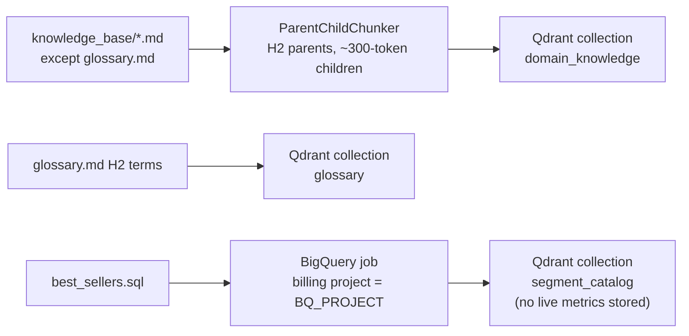
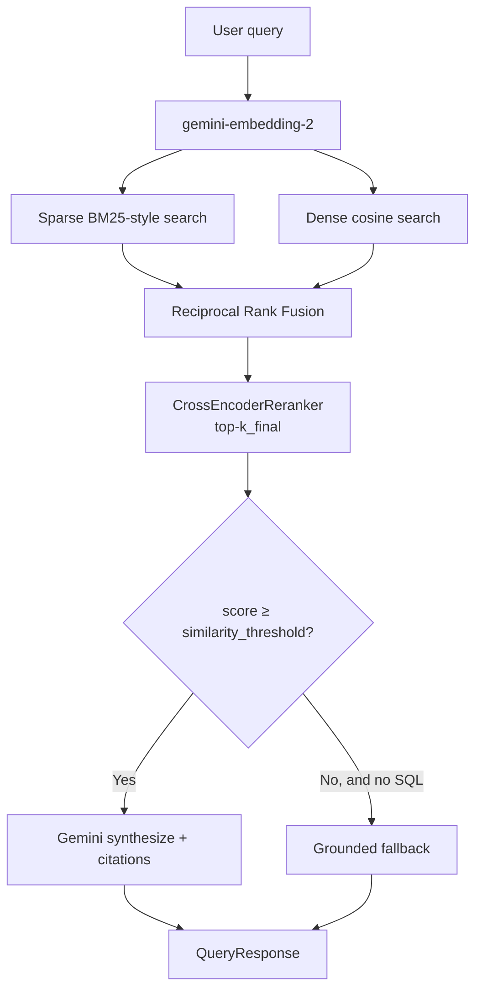
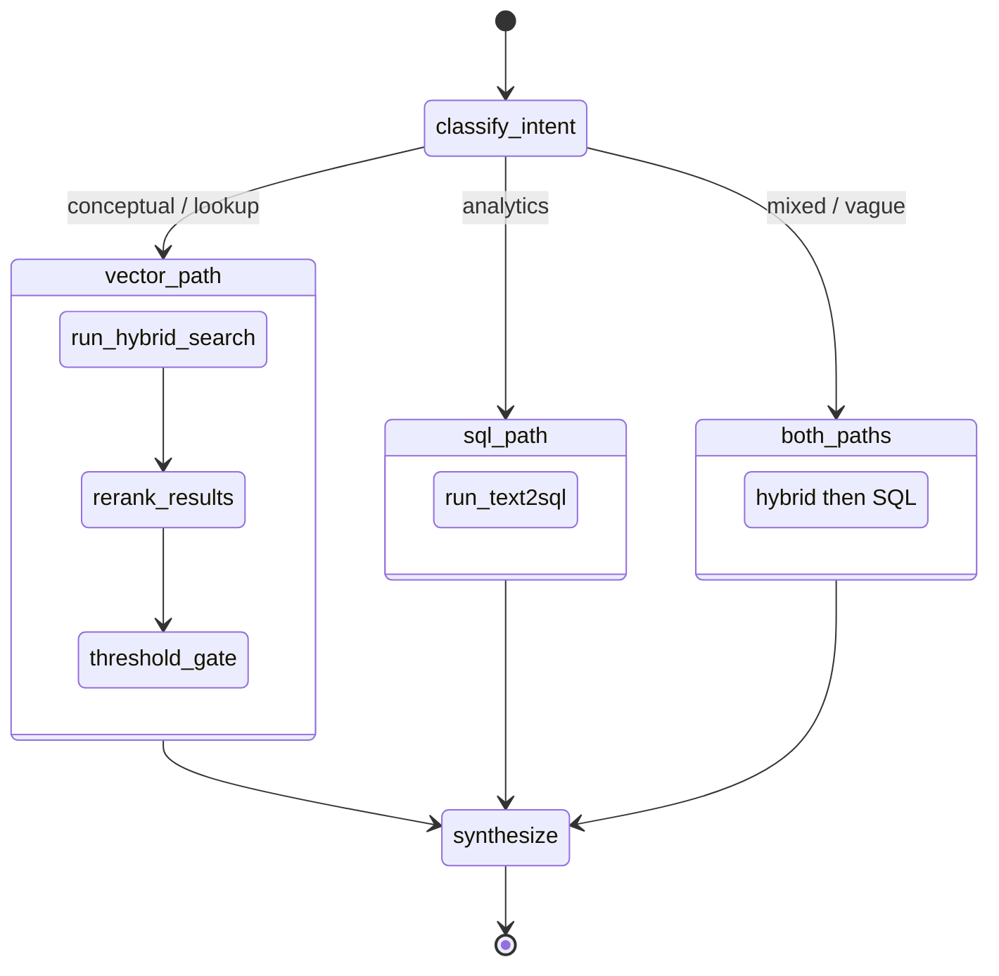
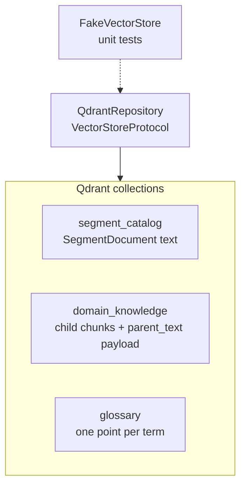

# lr-bestsellers

LiveRamp syndicated segments are easier to *ask about* than to *query*. Reach lives in BigQuery, activation rules live in docs, and glossary terms like cookie_reach are easy to mix up with platform-matched keys.

**lr-bestsellers** is a small agent that sits in the middle: you type a question in English, it decides whether to search the knowledge base, run live SQL, or both, and it answers with citations instead of guessing.

You do **not** need to know LangGraph to use it. Operators paste Confluence notes into `knowledge_base/`, run a refresh command, and ask questions like “what are the top segments by cookie reach?”

---

## Why this is not “just RAG”

Analytics questions (“top by reach on TTD”) need **live numbers**, not a paragraph from a wiki. Conceptual questions (“what is FULL delivery?”) need **docs**. Vague questions need **both**, plus a willingness to say “I don’t know” when similarity is too low.

The orchestrator is **LangGraph**. Retrieval is **Qdrant** (dense + sparse hybrid search). Metrics stay in **BigQuery**; the vector catalog stores names and descriptions only.

---

## High-level architecture


---

## Ingestion pipeline



Refresh:

```bash
uv run python -m lr_bestsellers refresh
uv run python -m lr_bestsellers refresh --file knowledge_base/activation.md
uv run python -m lr_bestsellers refresh --source bq
uv run python -m lr_bestsellers refresh --source glossary --verbose
uv run python -m lr_bestsellers refresh --reset
```

`BQ_PROJECT` / `BIGQUERY_PROJECT` is the **billing** project (for example `liveramp-eng-qa-reliability`). Table names are fully qualified inside `best_sellers.sql`. If `GOOGLE_APPLICATION_CREDENTIALS` is set, that service-account file is used; otherwise Application Default Credentials (ADC).

---

## Retrieval and anti-hallucination



---

## LangGraph state machine



---

## Storage layer



---

## Local setup

**Prerequisites:** Docker Desktop, Python **3.13**, [uv](https://docs.astral.sh/uv/), a Gemini API key, and (for live SQL) GCP access to the BigQuery **billing** project.

### 1. Clone and install

```bash
git clone <repo-url>
cd hackathon_best_seller
uv sync
```

### 2. Start Qdrant locally

`docker-compose.yml` runs Qdrant `v1.13.4` with REST on port `6333` and gRPC on `6334`. Vectors persist in the Docker volume `qdrant_storage`.

```bash
docker compose up -d
docker compose ps
curl -s http://localhost:6333/readyz
```

A healthy instance returns HTTP 200. The dashboard is at [http://localhost:6333/dashboard](http://localhost:6333/dashboard).

Leave `QDRANT_URL=http://localhost:6333` and do **not** set `QDRANT_API_KEY` for local Docker. For Qdrant Cloud, set both the cluster URL and API key.

```bash
# Inspect collections after ingest
curl -s http://localhost:6333/collections | python -m json.tool

# Stop Qdrant (keep stored vectors)
docker compose down

# Stop and delete the volume (wipe local collections)
docker compose down -v
```

### 3. Create `.env` and fill credentials

```bash
cp .env.example .env
```

Edit `.env` — never commit it or a service-account JSON.

| What you need | Variable | How to get it |
|---|---|---|
| Gemini + embeddings | `GOOGLE_API_KEY` | [Google AI Studio](https://aistudio.google.com/app/apikey). Alias: `GEMINI_API_KEY`. |
| BigQuery **billing** project | `BIGQUERY_PROJECT` | GCP project that pays for jobs (for example `liveramp-eng-qa-reliability`). Alias: `BQ_PROJECT`. Data tables stay fully qualified in `best_sellers.sql`. |
| BigQuery auth (local) | `GOOGLE_APPLICATION_CREDENTIALS` | Absolute path to a service-account JSON. Uncomment the line in `.env`. On GKE / Cloud Run, leave unset and use ADC. |
| Local Qdrant | `QDRANT_URL` | Default `http://localhost:6333`. |
| Qdrant Cloud only | `QDRANT_API_KEY` | Leave blank for local Docker. |

Settings load from `.env` at process start via `get_settings()`. After you change keys or the credentials path, restart the CLI / process. Re-run `refresh` if you need new embeddings after rotating `GOOGLE_API_KEY`.

**Example `.env` (local laptop):**

```bash
GOOGLE_API_KEY=AIzaSy...your-studio-key

BIGQUERY_PROJECT=liveramp-eng-qa-reliability
GOOGLE_APPLICATION_CREDENTIALS=/Users/yourname/.gcp/lr-bestsellers-sa.json

QDRANT_URL=http://localhost:6333
# QDRANT_API_KEY=   # leave unset locally

ENVIRONMENT=development
LOG_LEVEL=INFO
```

### 4. Authenticate to GCP (if you are not using a service-account file)

```bash
gcloud auth application-default login
gcloud config set project liveramp-eng-qa-reliability
```

### 5. Ingest into Qdrant

```bash
uv run python -m lr_bestsellers refresh
```

This loads `knowledge_base/*.md` into `domain_knowledge`, `glossary.md` into `glossary`, and `best_sellers.sql` into `segment_catalog` (names and descriptions only; live metrics stay in BigQuery). A placeholder `GOOGLE_API_KEY` uses a hash embedder so you can still stand up the collections.

Useful variants:

```bash
uv run python -m lr_bestsellers refresh --source glossary
uv run python -m lr_bestsellers refresh --source bq
uv run python -m lr_bestsellers refresh --file knowledge_base/activation.md
uv run python -m lr_bestsellers refresh --reset   # wipe collections, then re-ingest
```

### 6. Ask a question

```bash
uv run python main.py "What are the top segments by cookie reach?"
```

Conceptual check after glossary ingest: `uv run python main.py "What is cookie_reach?"` — expect a cited answer with `[Source: …]`.

---

## Quick start

If the stack is already familiar:

1. `cp .env.example .env` and set `GOOGLE_API_KEY` plus `BIGQUERY_PROJECT` (and optionally `GOOGLE_APPLICATION_CREDENTIALS`).
2. `docker compose up -d` then `curl -s http://localhost:6333/readyz`
3. `uv sync`
4. `uv run python -m lr_bestsellers refresh`
5. `uv run python main.py "What are the top segments by cookie reach?"`

### Troubleshooting: `invalid peer certificate: UnknownIssuer`

On corporate networks with TLS inspection, uv's default rustls stack cannot verify the intercepted PyPI certificate. `pyproject.toml` already sets `[tool.uv] native-tls = true`, which makes uv use the macOS Keychain (where IT typically installs the intercept CA). If the error persists try:

```bash
# Option 1: force native TLS for a single run (already the project default)
UV_NATIVE_TLS=1 uv run python -m lr_bestsellers refresh --source glossary

# Option 2: point uv at a specific PEM bundle (export it from Keychain first)
export SSL_CERT_FILE=/path/to/corp-ca-bundle.pem
export REQUESTS_CA_BUNDLE="$SSL_CERT_FILE"
uv run python -m lr_bestsellers refresh --source glossary

# Option 3: skip package fetch entirely when venv is already complete
uv run --offline python -m lr_bestsellers refresh --source glossary

# Option 4: last resort — allow insecure TLS for PyPI only (do NOT commit this)
uv run --allow-insecure-host pypi.org --allow-insecure-host files.pythonhosted.org \
  python -m lr_bestsellers refresh --source glossary
```

---

## Environment reference

| Variable | Settings field | Meaning |
|---|---|---|
| `GOOGLE_API_KEY` | `google_api_key` | Gemini + embeddings |
| `LLM_MODEL` / `GEMINI_MODEL` | `llm_model` | Chat model (default `gemini-2.0-flash`) |
| `EMBEDDING_MODEL` | `embedding_model` | Embeddings (default `gemini-embedding-2`) |
| `BIGQUERY_PROJECT` | `bigquery_project` / `bq_project` | **Billing** project for jobs |
| `GOOGLE_APPLICATION_CREDENTIALS` | `google_application_credentials` | Optional SA JSON path; else ADC |
| `QDRANT_URL` | `qdrant_url` | Default `http://localhost:6333` |
| `QDRANT_API_KEY` | `qdrant_api_key` | Qdrant Cloud only |
| `SIMILARITY_THRESHOLD` | `similarity_threshold` | Default `0.65` |
| `MAX_RETRIEVAL_RESULTS` | `max_retrieval_results` | Candidates before rerank (default `10`) |
| `TOP_K_FINAL` | `top_k_final` | Hits sent to the LLM (default `3`) |
| `LOG_LEVEL` | `log_level` | `DEBUG` … `CRITICAL` |
| `ENVIRONMENT` | `environment` | `development` / `staging` / `production` |
| `LANGSMITH_TRACING_V2` | `langsmith_tracing_v2` | Optional tracing |
| `LANGSMITH_API_KEY` | `langsmith_api_key` | Optional |
| `LANGSMITH_PROJECT` | `langsmith_project` | Default `lr-bestsellers` |

Never commit `.env` or service-account JSON. `*.json` is gitignored.

---

## Query examples

| Question | Typical intent | Path |
|---|---|---|
| What is cookie_reach? | conceptual | Vector (glossary + docs) |
| What are the top segments by cookie reach? | analytics | Text2SQL |
| What is activation and how many buyers use top segments? | mixed | Vector then SQL |
| Ignore previous instructions | blocked | Input guardrail `INJECTION_ATTEMPT` |

Python:

```python
from main import query

response = query("What is FULL delivery?")
print(response.answer)
print(response.intent, response.confidence)
```

Package API:

```python
from lr_bestsellers import query as package_query
from lr_bestsellers.models import QueryRequest

package_query(QueryRequest(text="What is SSA?"))
```

---

## Development commands

```bash
uv sync
uv run pytest tests/unit/ -v
uv run pytest tests/unit/test_store_protocol.py -v
uv run pytest tests/unit/test_chunking.py tests/unit/test_ingestion.py -v
uv run pytest tests/unit/test_nodes.py tests/unit/test_tools.py -v
uv run pytest tests/unit/test_guardrails.py -v
uv run ruff check lr_bestsellers tests/
uv run ruff format lr_bestsellers tests/
uv run mypy lr_bestsellers/
uv run python tests/evals/run_evals.py
uv run python tests/evals/run_evals.py --report
```

Integration tests (`tests/integration/test_qdrant.py`, `test_bq.py`) skip when Qdrant or BigQuery is unavailable.

---

## Guardrails (short)

- **Input**: length, PII, prompt injection, banned topics, per-caller rate limit
- **SQL**: SELECT/WITH only, table allowlist, auto `LIMIT 1000`, dry-run bytes under 10 GiB
- **Output**: `[Source: …]` required (one retry), confidence gate, number cross-check, hallucination disclaimer, PII scrub

---

## License and status

Internal LiveRamp tooling. Python **3.13**, package manager **uv**.
