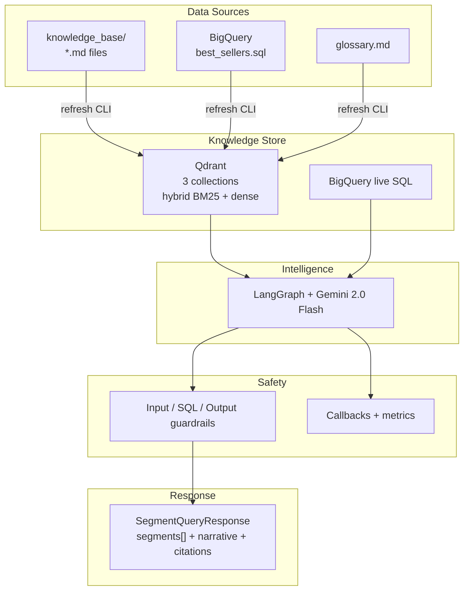

# lr-bestsellers

LiveRamp syndicated segments are easier to *ask about* than to *query*. Reach lives in BigQuery, activation rules live in docs, and glossary terms like cookie_reach are easy to mix up with platform-matched keys.

**lr-bestsellers** is an agent that sits in the middle: you send a plain-English question to the API, it decides whether to search the knowledge base, run live SQL, or both, and it returns structured segment objects — not markdown prose.

---

## High-level architecture



---

## Local setup

**Prerequisites:** Docker Desktop, Python **3.13**, [uv](https://docs.astral.sh/uv/), a Gemini API key, and (for live SQL) GCP access to the BigQuery **billing** project.

### 1. Clone and install

```bash
git clone <repo-url>
cd hackathon_best_seller
uv sync
```

### 2. Start Qdrant locally

`docker-compose.yml` runs Qdrant `v1.13.4` with REST on port `6333` and gRPC on `6334`. Vectors persist in the Docker volume `qdrant_storage`.

```bash
docker compose up -d
docker compose ps
curl -s http://localhost:6333/readyz
```

A healthy instance returns HTTP 200. The dashboard is at [http://localhost:6333/dashboard](http://localhost:6333/dashboard).

Leave `QDRANT_URL=http://localhost:6333` and do **not** set `QDRANT_API_KEY` for local Docker. For Qdrant Cloud, set both the cluster URL and API key.

```bash
# Inspect collections after ingest
curl -s http://localhost:6333/collections | python -m json.tool

# Stop Qdrant (keep stored vectors)
docker compose down

# Stop and delete the volume (wipe local collections)
docker compose down -v
```

### 3. Create `.env` and fill credentials

```bash
cp .env.example .env
```

Edit `.env` — never commit it or a service-account JSON.

| What you need                | Variable                         | How to get it                                                                                                                                            |
| ---------------------------- | -------------------------------- | -------------------------------------------------------------------------------------------------------------------------------------------------------- |
| Gemini + embeddings          | `GOOGLE_API_KEY`                 | [Google AI Studio](https://aistudio.google.com/app/apikey). Alias: `GEMINI_API_KEY`.                                                                     |
| BigQuery **billing** project | `BIGQUERY_PROJECT`               | GCP project that pays for jobs (for example `liveramp-eng-qa-reliability`). Alias: `BQ_PROJECT`. Data tables stay fully qualified in `best_sellers.sql`. |
| BigQuery auth (local)        | `GOOGLE_APPLICATION_CREDENTIALS` | Absolute path to a service-account JSON. Uncomment the line in `.env`. On GKE / Cloud Run, leave unset and use ADC.                                      |
| Local Qdrant                 | `QDRANT_URL`                     | Default `http://localhost:6333`.                                                                                                                         |
| Qdrant Cloud only            | `QDRANT_API_KEY`                 | Leave blank for local Docker.                                                                                                                            |

Settings load from `.env` at process start via `get_settings()`. After you change keys or the credentials path, restart the server.

**Example `.env` (local laptop):**

```bash
GOOGLE_API_KEY=AIzaSy...your-studio-key

BIGQUERY_PROJECT=liveramp-eng-qa-reliability
GOOGLE_APPLICATION_CREDENTIALS=/Users/yourname/.gcp/lr-bestsellers-sa.json

QDRANT_URL=http://localhost:6333
# QDRANT_API_KEY=   # leave unset locally

ENVIRONMENT=development
LOG_LEVEL=INFO
```

### 4. Authenticate to GCP (if you are not using a service-account file)

```bash
gcloud auth application-default login
gcloud config set project liveramp-eng-qa-reliability
```

### 5. Ingest into Qdrant

```bash
uv run python -m lr_bestsellers refresh
```

This loads `knowledge_base/*.md` into `domain_knowledge`, `glossary.md` into `glossary`, and the segment catalog into `segment_catalog` (names and descriptions only; live metrics stay in BigQuery).

**Refresh commands:**

```bash
# Refresh everything (docs + glossary + BQ catalog)
uv run python -m lr_bestsellers refresh

# Refresh one source at a time
uv run python -m lr_bestsellers refresh --source files
uv run python -m lr_bestsellers refresh --source glossary
uv run python -m lr_bestsellers refresh --source bq          # live BigQuery query (slower)
uv run python -m lr_bestsellers refresh --source csv         # local export (faster)

# Seed canonical platform names for the platform resolver (run once after initial setup)
uv run python -m lr_bestsellers refresh --source platform_names

# Wipe all collections first, then re-ingest everything
uv run python -m lr_bestsellers refresh --reset

# Resume a CSV ingestion interrupted at row N
uv run python -m lr_bestsellers refresh --source csv --skip-rows 479000
```

> **`--source platform_names`** must be run at least once after initial setup so queries like
> `"activated to tradedesk"` resolve to `"The Trade Desk"` before the SQL prompt is built.

#### Using the CSV catalog export (recommended for large catalogs)

```bash
# Place the export in the repo root, then run:
uv run python -m lr_bestsellers refresh --source csv

# Or point to any path:
uv run python -m lr_bestsellers refresh --source csv --file /path/to/export.csv
```

Required CSV columns (case-insensitive, UTF-8 BOM OK):
`dms_segment_id`, `seller_customer_id`, `segment_name`, `segment_description`.

The CSV file is **git-ignored** — do not commit it.

### 6. Start the API server

```bash
uv run uvicorn lr_bestsellers.api.app:app --reload --port 8888
```

Swagger UI is at [http://localhost:8888/docs](http://localhost:8888/docs), ReDoc at `/redoc`, and the OpenAPI schema at `/openapi.json`.

---

## HTTP API

### `POST /v1/query` — Structured segment search *(primary endpoint)*

Submit a plain-English question and receive each matched segment as a typed object. No markdown to parse.

**Request**

```bash
curl -X POST http://localhost:8888/v1/query \
  -H "Content-Type: application/json" \
  -d '{"query": "Frequent international travelers, business class preferred"}'
```

Request body fields:

| Field | Type | Default | Description |
|---|---|---|---|
| `query` | string | required | Plain-English question, 1–2000 characters. |
| `caller_id` | string | `"api"` | Opaque rate-limit bucket key. |

**Response**

```json
{
  "query": "Frequent international travelers, business class preferred",
  "intent": "mixed",
  "confidence": 0.91,
  "total_found": 6,
  "segments": [
    {
      "rank": 1,
      "dms_segment_id": "123456",
      "segment_name": "AlikeAudience: United States > Interest > Luxury Travel > First Class/Business Class Flights",
      "description": "Includes people residing in the United States who are interested in first class/business class flights based on mobile app downloads, usage, and luxury travel behavior.",
      "distribution_rank": 14090,
      "impressions_rank": null,
      "provider_revenue_rank": null,
      "buyer_usage_rank": null,
      "platform_usage_rank": null,
      "active_platform_names": ["The Trade Desk", "Google DV360"],
      "source": "BigQuery",
      "relevance_score": null
    },
    {
      "rank": 2,
      "dms_segment_id": "789012",
      "segment_name": "Experian > Lifestyle and Interests (Affinity) > Travel > Frequent International Travelers",
      "description": "Consumers who regularly travel abroad for leisure or business.",
      "distribution_rank": 10283,
      "impressions_rank": null,
      "provider_revenue_rank": null,
      "buyer_usage_rank": null,
      "platform_usage_rank": null,
      "active_platform_names": [],
      "source": "BigQuery",
      "relevance_score": null
    }
  ],
  "narrative": "Here are the relevant LiveRamp syndicated segments...",
  "sql_used": "WITH bestsellers AS (...) SELECT segment_name, dms_segment_id, distribution_rank FROM ...",
  "citations": [
    { "source": "BigQuery", "text": "...", "score": 1.0 }
  ],
  "processing_time_ms": 2341
}
```

Response field reference:

| Field | Type | Description |
|---|---|---|
| `query` | string | The original question. |
| `intent` | string | Classified routing intent: `analytics`, `conceptual`, `lookup`, `mixed`, or `vague`. |
| `confidence` | float | Agent self-assessed confidence, 0–1. |
| `total_found` | int | Number of distinct segments returned. |
| `segments` | array | Ordered list of matched segment objects (see below). |
| `narrative` | string | LLM-generated prose answer with inline citations — useful for human-facing UIs. |
| `sql_used` | string \| null | BigQuery SQL executed, or null when only vector search was used. |
| `citations` | array | Evidence fragments cited in the answer. |
| `processing_time_ms` | int \| null | Wall-clock milliseconds for the full pipeline call. |

Each `segments[]` object:

| Field | Type | Description |
|---|---|---|
| `rank` | int | 1-based result position. |
| `dms_segment_id` | string \| null | Unique LiveRamp segment identifier. |
| `segment_name` | string | Human-readable segment taxonomy path. |
| `description` | string \| null | Segment description text. |
| `distribution_rank` | int \| null | Dense rank by distribution footprint (1 = widest). |
| `impressions_rank` | int \| null | Dense rank by impressions (1 = highest). |
| `provider_revenue_rank` | int \| null | Dense rank by provider net revenue (1 = highest). |
| `buyer_usage_rank` | int \| null | Dense rank by buyers with usage (1 = highest). |
| `platform_usage_rank` | int \| null | Dense rank by platforms with usage (1 = highest). |
| `active_platform_names` | array of strings | Platforms the segment is currently distributed to. |
| `source` | string | `"BigQuery"`, `"VectorSearch"`, or `"hybrid"`. |
| `relevance_score` | float \| null | Cosine similarity score (vector search only; null for SQL results). |

---

### `GET /v1/health` — Liveness check

```bash
curl http://localhost:8888/v1/health
```

```json
{ "status": "ok", "version": "1.0.0" }
```

No I/O — confirms the process is alive. Use this for load balancer health checks.

---

### `GET /v1/segments` — Browse segment catalog

Pages the offline CSV dump of the BigQuery segment recommendation features table. No LLM or BigQuery calls involved.

```bash
curl "http://localhost:8888/v1/segments?page=1&page_size=2"
```

```json
{
  "mode": "catalog",
  "source": "segment_recommendation_features.csv",
  "pagination": {
    "page": 1,
    "page_size": 2,
    "total_items": 14633,
    "total_pages": 7317,
    "has_next": true,
    "has_previous": false
  },
  "items": [
    {
      "dms_segment_id": 32003,
      "segment_name": "Acxiom US Demographic > Age > Adult Age in HH > 35-44",
      "segment_description": "Someone in the household is between the ages of 35-44",
      "active_platform_names": ["A&E Networks", "Altice / NYI", "Ampersand"],
      "impressions": 25662800.19939599,
      "popularity_rank": 1,
      "is_top_n_popular": true,
      "usage_start_date": "2026-07-26"
    }
  ]
}
```

Query parameters:

| Parameter | Default | Meaning |
|---|---|---|
| `page` | `1` | 1-based page number. |
| `page_size` | `50` | Rows per page, max `200`. |

---

### Error responses

All errors share one envelope:

```json
{ "error": "<CODE>", "detail": "<human-readable message>" }
```

| Status | When | `error` |
|---|---|---|
| `400` | Input guardrail rejected the query | Guardrail code, e.g. `PII_DETECTED` |
| `422` | Parameter validation failed | FastAPI validation body |
| `500` | Retrieval, embedding, or SQL generation failure | `PIPELINE_ERROR` |
| `502` | Answer failed an output guardrail | Guardrail code, e.g. `MISSING_CITATION` |
| `503` | CSV dump missing or malformed | `CATALOG_UNAVAILABLE` |

---

## Quick start

If the stack is already familiar:

1. `cp .env.example .env` and set `GOOGLE_API_KEY` plus `BIGQUERY_PROJECT` (and optionally `GOOGLE_APPLICATION_CREDENTIALS`).
2. `docker compose up -d` then `curl -s http://localhost:6333/readyz`
3. `uv sync`
4. `uv run python -m lr_bestsellers refresh`
5. `uv run uvicorn lr_bestsellers.api.app:app --reload --port 8888`
6. `curl -X POST http://localhost:8888/v1/query -H "Content-Type: application/json" -d '{"query": "What are the top segments by cookie reach?"}'`

---

## Troubleshooting: `invalid peer certificate: UnknownIssuer`

On corporate networks with TLS inspection, uv's default rustls stack cannot verify the intercepted PyPI certificate. `pyproject.toml` already sets `[tool.uv] native-tls = true`, which makes uv use the macOS Keychain (where IT typically installs the intercept CA). If the error persists try:

```bash
# Option 1: force native TLS for a single run (already the project default)
UV_NATIVE_TLS=1 uv run python -m lr_bestsellers refresh --source glossary

# Option 2: point uv at a specific PEM bundle (export it from Keychain first)
export SSL_CERT_FILE=/path/to/corp-ca-bundle.pem
export REQUESTS_CA_BUNDLE="$SSL_CERT_FILE"
uv run python -m lr_bestsellers refresh --source glossary

# Option 3: skip package fetch entirely when venv is already complete
uv run --offline python -m lr_bestsellers refresh --source glossary

# Option 4: last resort — allow insecure TLS for PyPI only (do NOT commit this)
uv run --allow-insecure-host pypi.org --allow-insecure-host files.pythonhosted.org \
  python -m lr_bestsellers refresh --source glossary
```

---

## Environment reference

| Variable                         | Settings field                    | Meaning                                   |
| -------------------------------- | --------------------------------- | ----------------------------------------- |
| `GOOGLE_API_KEY`                 | `google_api_key`                  | Gemini + embeddings                       |
| `LLM_MODEL` / `GEMINI_MODEL`     | `llm_model`                       | Chat model (default `gemini-3.6-flash`)   |
| `EMBEDDING_MODEL`                | `embedding_model`                 | Embeddings (default `gemini-embedding-2`) |
| `BIGQUERY_PROJECT`               | `bigquery_project` / `bq_project` | **Billing** project for jobs              |
| `GOOGLE_APPLICATION_CREDENTIALS` | `google_application_credentials`  | Optional SA JSON path; else ADC           |
| `CSV_CATALOG_PATH`               | `csv_catalog_path`                | CSV dump for browse mode (default `csv_dump/segment_recommendation_features.csv`). Alias: `CSV_DUMP_PATH` |
| `QDRANT_URL`                     | `qdrant_url`                      | Default `http://localhost:6333`           |
| `QDRANT_API_KEY`                 | `qdrant_api_key`                  | Qdrant Cloud only                         |
| `SIMILARITY_THRESHOLD`           | `similarity_threshold`            | Default `0.65`                            |
| `MAX_RETRIEVAL_RESULTS`          | `max_retrieval_results`           | Candidates before rerank (default `10`)   |
| `TOP_K_FINAL`                    | `top_k_final`                     | Hits sent to the LLM (default `3`)        |
| `LOG_LEVEL`                      | `log_level`                       | `DEBUG` … `CRITICAL`                      |
| `ENVIRONMENT`                    | `environment`                     | `development` / `staging` / `production`  |
| `LANGSMITH_TRACING_V2`           | `langsmith_tracing_v2`            | Optional tracing                          |
| `LANGSMITH_API_KEY`              | `langsmith_api_key`               | Optional                                  |
| `LANGSMITH_PROJECT`              | `langsmith_project`               | Default `lr-bestsellers`                  |

Never commit `.env` or service-account JSON. `*.json` is gitignored.

---

## Development commands

```bash
uv sync
uv run pytest tests/unit/ -v
uv run pytest tests/unit/test_api.py tests/unit/test_csv_catalog.py -v
uv run uvicorn lr_bestsellers.api.app:app --reload --port 8888
uv run ruff check lr_bestsellers tests/
uv run ruff format lr_bestsellers tests/
uv run mypy lr_bestsellers/
```

Integration tests (`tests/integration/test_qdrant.py`, `test_bq.py`) skip when Qdrant or BigQuery is unavailable.

---

## Guardrails

- **Input**: length, PII, prompt injection, banned topics, per-caller rate limit
- **SQL**: SELECT/WITH only, table allowlist, auto `LIMIT 1000`, dry-run bytes under 10 GiB
- **Output**: `[Source: …]` required (one retry), confidence gate, number cross-check, hallucination disclaimer, PII scrub

---

## License and status

Internal LiveRamp tooling. Python **3.13**, package manager **uv**.
