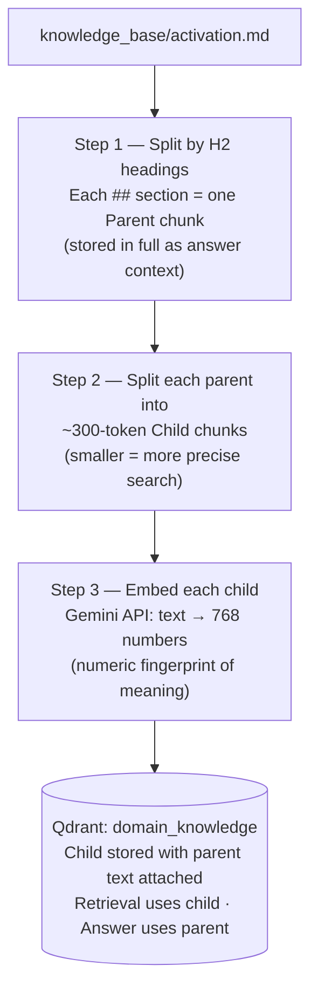
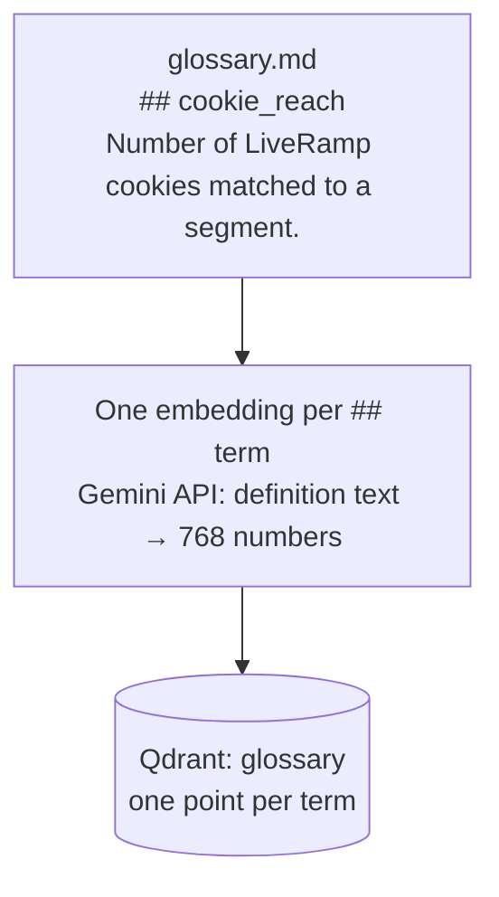
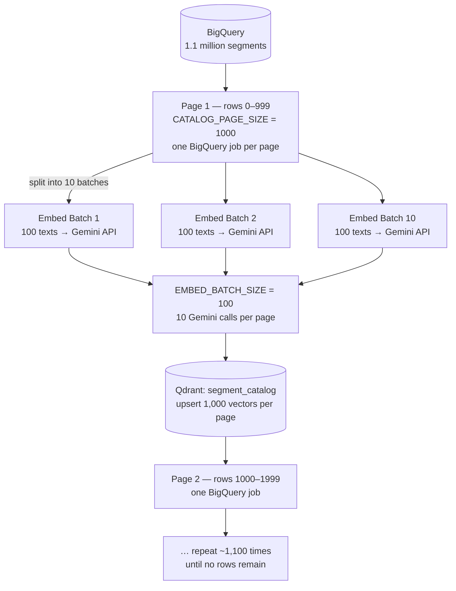
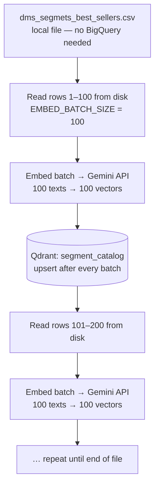
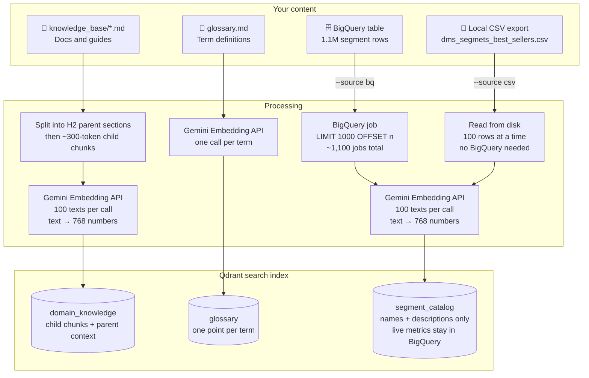
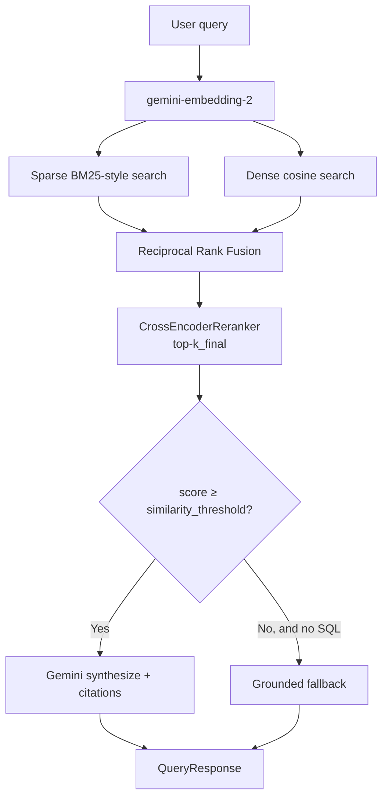
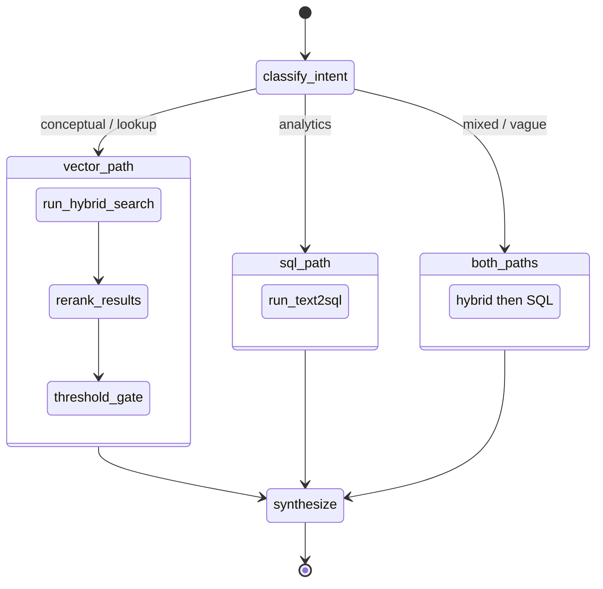
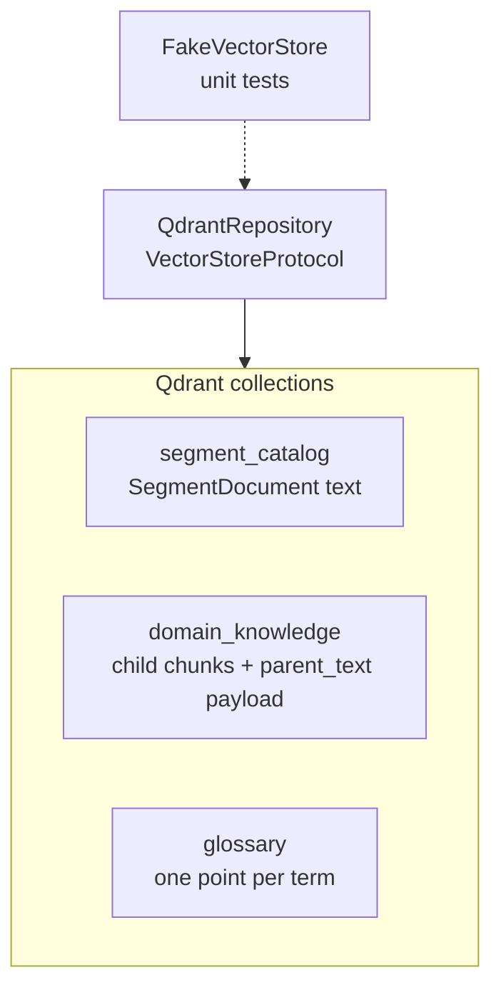
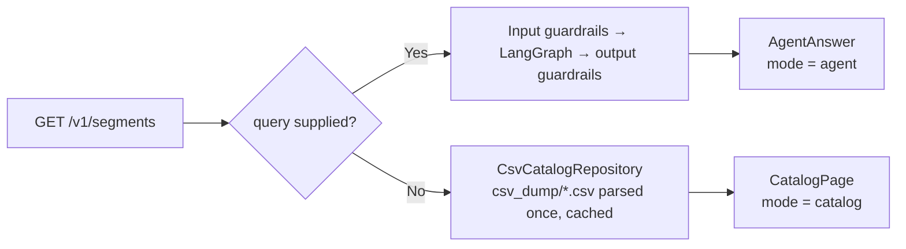

# lr-bestsellers

LiveRamp syndicated segments are easier to *ask about* than to *query*. Reach lives in BigQuery, activation rules live in docs, and glossary terms like cookie_reach are easy to mix up with platform-matched keys.

**lr-bestsellers** is a small agent that sits in the middle: you type a question in English, it decides whether to search the knowledge base, run live SQL, or both, and it answers with citations instead of guessing.

You do **not** need to know LangGraph to use it. Operators paste Confluence notes into `knowledge_base/`, run a refresh command, and ask questions like “what are the top segments by cookie reach?”

---

## Why this is not “just RAG”

Analytics questions (“top by reach on TTD”) need **live numbers**, not a paragraph from a wiki. Conceptual questions (“what is FULL delivery?”) need **docs**. Vague questions need **both**, plus a willingness to say “I don’t know” when similarity is too low.

The orchestrator is **LangGraph**. Retrieval is **Qdrant** (dense + sparse hybrid search). Metrics stay in **BigQuery**; the vector catalog stores names and descriptions only.

---

## High-level architecture


---

## Ingestion layer — how it works

### The big picture

Think of ingestion as **teaching the system before you can ask it questions**.

The system cannot answer questions about segments, glossary terms, or activation docs out of thin air. Before it can help, it needs to:

1. **Read** all your content (docs, glossary, segment names).
2. **Convert each piece of text into a numeric fingerprint** — called an *embedding* — that captures its meaning, not just its words. Two sentences that mean the same thing get similar fingerprints even if they use different words.
3. **Store those fingerprints in a fast search index** (Qdrant), so that when a user asks a question, the system can instantly find the most relevant pieces.

You run ingestion once (or whenever your content changes). Asking questions never touches this step.

---

### What gets ingested and where it goes

There are three separate "libraries" (called *collections*) stored in Qdrant:


| Library            | What goes in                                         | Comes from                   |
| ------------------ | ---------------------------------------------------- | ---------------------------- |
| `domain_knowledge` | How-to docs, activation guides, platform notes       | `knowledge_base/*.md` files  |
| `glossary`         | Term definitions (cookie_reach, FULL delivery, etc.) | `knowledge_base/glossary.md` |
| `segment_catalog`  | Segment names + descriptions (no live numbers)       | BigQuery or local CSV        |


Live metrics (reach, buyers, distribution) are **never stored** in Qdrant. They are fetched fresh from BigQuery every time someone asks an analytics question.

---

### Source 1 — Knowledge base docs (`knowledge_base/*.md`)

Plain-English documentation lives as markdown files. Here is what happens when you refresh:



**Why split into parent and child?** Smaller chunks find better matches (precision). But the LLM needs more context to write a good answer, so the parent text is always attached. Best of both worlds.

---

### Source 2 — Glossary (`glossary.md`)

Each term under a `##` heading becomes one entry. No splitting — a definition is already small enough.



---

### Source 3 — Segment catalog (the large one)

The segment catalog has **over 1 million rows**. Processing all of them at once would crash your laptop and exhaust the Gemini API. So the system processes them in small, manageable batches. There are two ways to load the catalog:

#### Path A — Direct BigQuery query (`--source bq`)

The system queries BigQuery live and pages through results 1,000 rows at a time.



**`CATALOG_PAGE_SIZE = 1000`** — how many rows come back from BigQuery per query.
**`EMBED_BATCH_SIZE = 100`** — how many texts are sent to Gemini per API call.

These two work at different levels and are independent. You can change them separately.

#### Path B — Local CSV export (`--source csv`) ← recommended

If you have already downloaded the catalog as a CSV file, this path skips BigQuery entirely. It reads the file from disk in 100-row pages.



**Why is CSV faster?** No network round-trip to BigQuery per page. Reading from disk is nearly instant, so the only bottleneck is the Gemini API (which is the same for both paths). Fewer moving parts = fewer things that can fail.

#### Choosing between BQ and CSV


|                       | `--source bq`           | `--source csv`                        |
| --------------------- | ----------------------- | ------------------------------------- |
| Needs BigQuery access | Yes                     | No (just the file)                    |
| Always up to date     | Yes                     | Only as fresh as the export           |
| Speed                 | Slower (~1,100 BQ jobs) | Faster (disk reads)                   |
| Network dependency    | BigQuery + Gemini       | Gemini only                           |
| Good for              | CI / automated refresh  | Developer setup, large one-time loads |


---

### How "upsert" keeps re-runs safe

Every ingestion uses **upsert** (update-or-insert), keyed on `dms_segment_id`. If a segment was already stored, its record is overwritten with the new embedding. No duplicates are created. This means:

- You can safely re-run ingestion at any time.
- You can stop a run halfway and resume — whatever already landed stays valid.
- Switching from BQ to CSV (or vice versa) overwrites matching IDs cleanly.

---

### Full ingestion pipeline — all sources




---

### Refresh commands

```bash
# Refresh everything (docs + glossary + BQ catalog)
uv run python -m lr_bestsellers refresh

# Refresh one source at a time
uv run python -m lr_bestsellers refresh --source files
uv run python -m lr_bestsellers refresh --source glossary
uv run python -m lr_bestsellers refresh --source bq          # live BigQuery query (slower)
uv run python -m lr_bestsellers refresh --source csv         # local export (faster, see below)

# Refresh a single doc file
uv run python -m lr_bestsellers refresh --file knowledge_base/activation.md

# Wipe all collections first, then re-ingest everything
uv run python -m lr_bestsellers refresh --reset
```

`BQ_PROJECT` / `BIGQUERY_PROJECT` is the **billing** project (for example `liveramp-eng-qa-reliability`). Table names are fully qualified inside `best_sellers.sql`. If `GOOGLE_APPLICATION_CREDENTIALS` is set, that service-account file is used; otherwise Application Default Credentials (ADC).

---

## Retrieval and anti-hallucination




---

## LangGraph state machine




---

## Storage layer




---

## Local setup

**Prerequisites:** Docker Desktop, Python **3.13**, [uv](https://docs.astral.sh/uv/), a Gemini API key, and (for live SQL) GCP access to the BigQuery **billing** project.

### 1. Clone and install

```bash
git clone <repo-url>
cd hackathon_best_seller
uv sync
```

### 2. Start Qdrant locally

`docker-compose.yml` runs Qdrant `v1.13.4` with REST on port `6333` and gRPC on `6334`. Vectors persist in the Docker volume `qdrant_storage`.

```bash
docker compose up -d
docker compose ps
curl -s http://localhost:6333/readyz
```

A healthy instance returns HTTP 200. The dashboard is at [http://localhost:6333/dashboard](http://localhost:6333/dashboard).

Leave `QDRANT_URL=http://localhost:6333` and do **not** set `QDRANT_API_KEY` for local Docker. For Qdrant Cloud, set both the cluster URL and API key.

```bash
# Inspect collections after ingest
curl -s http://localhost:6333/collections | python -m json.tool

# Stop Qdrant (keep stored vectors)
docker compose down

# Stop and delete the volume (wipe local collections)
docker compose down -v
```

### 3. Create `.env` and fill credentials

```bash
cp .env.example .env
```

Edit `.env` — never commit it or a service-account JSON.


| What you need                | Variable                         | How to get it                                                                                                                                            |
| ---------------------------- | -------------------------------- | -------------------------------------------------------------------------------------------------------------------------------------------------------- |
| Gemini + embeddings          | `GOOGLE_API_KEY`                 | [Google AI Studio](https://aistudio.google.com/app/apikey). Alias: `GEMINI_API_KEY`.                                                                     |
| BigQuery **billing** project | `BIGQUERY_PROJECT`               | GCP project that pays for jobs (for example `liveramp-eng-qa-reliability`). Alias: `BQ_PROJECT`. Data tables stay fully qualified in `best_sellers.sql`. |
| BigQuery auth (local)        | `GOOGLE_APPLICATION_CREDENTIALS` | Absolute path to a service-account JSON. Uncomment the line in `.env`. On GKE / Cloud Run, leave unset and use ADC.                                      |
| Local Qdrant                 | `QDRANT_URL`                     | Default `http://localhost:6333`.                                                                                                                         |
| Qdrant Cloud only            | `QDRANT_API_KEY`                 | Leave blank for local Docker.                                                                                                                            |


Settings load from `.env` at process start via `get_settings()`. After you change keys or the credentials path, restart the CLI / process. Re-run `refresh` if you need new embeddings after rotating `GOOGLE_API_KEY`.

**Example `.env` (local laptop):**

```bash
GOOGLE_API_KEY=AIzaSy...your-studio-key

BIGQUERY_PROJECT=liveramp-eng-qa-reliability
GOOGLE_APPLICATION_CREDENTIALS=/Users/yourname/.gcp/lr-bestsellers-sa.json

QDRANT_URL=http://localhost:6333
# QDRANT_API_KEY=   # leave unset locally

ENVIRONMENT=development
LOG_LEVEL=INFO
```

### 4. Authenticate to GCP (if you are not using a service-account file)

```bash
gcloud auth application-default login
gcloud config set project liveramp-eng-qa-reliability
```

### 5. Ingest into Qdrant

```bash
uv run python -m lr_bestsellers refresh
```

This loads `knowledge_base/*.md` into `domain_knowledge`, `glossary.md` into `glossary`, and `best_sellers.sql` into `segment_catalog` (names and descriptions only; live metrics stay in BigQuery). A placeholder `GOOGLE_API_KEY` uses a hash embedder so you can still stand up the collections.

Useful variants:

```bash
uv run python -m lr_bestsellers refresh --source glossary
uv run python -m lr_bestsellers refresh --source bq          # live BigQuery query (slower)
uv run python -m lr_bestsellers refresh --source csv         # local export (faster, see below)
uv run python -m lr_bestsellers refresh --file knowledge_base/activation.md
uv run python -m lr_bestsellers refresh --reset   # wipe collections, then re-ingest
```

#### Using the CSV catalog export (recommended for large catalogs)

BigQuery exports can be slow and expensive. An alternative is to download the segment
catalog as a CSV (BigQuery UI → **Export → Download as CSV**) and use `--source csv`:

```bash
# Place the export in the repo root with this exact name…
dms_segmets_best_sellers.csv

# …then run:
uv run python -m lr_bestsellers refresh --source csv

# Or point to any path:
uv run python -m lr_bestsellers refresh --source csv --file /path/to/export.csv
```

Required CSV columns (case-insensitive, UTF-8 BOM OK):
`dms_segment_id`, `seller_customer_id`, `segment_name`, `segment_description`.

The CSV file is **git-ignored** — do not commit it.

### 6. Ask a question

```bash
uv run python main.py "What are the top segments by cookie reach?"
```

Conceptual check after glossary ingest: `uv run python main.py "What is cookie_reach?"` — expect a cited answer with `[Source: …]`.

### 7. Serve the HTTP API

```bash
uv run uvicorn lr_bestsellers.api.app:app --reload
```

Swagger UI is at [http://localhost:8000/docs](http://localhost:8000/docs), ReDoc at `/redoc`, and the OpenAPI schema at `/openapi.json`.

---

## HTTP API

One endpoint, two behaviours, chosen by whether `query` is present.



`GET /v1/segments`

| Parameter | Where | Default | Meaning |
|---|---|---|---|
| `query` | query string | *(none)* | Plain-English question, up to 2000 characters. Blank or absent switches to browse mode. |
| `page` | query string | `1` | 1-based page number. Browse mode only. |
| `page_size` | query string | `50` | Rows per page, max `200`. Browse mode only. |
| `X-Caller-Id` | header | `api` | Rate-limit bucket key. Ask mode only. |

**Browse mode** — no `query`, so no LLM and no BigQuery call. The CSV dump of the segment recommendation features table is parsed on first request and cached, so later pages are served from memory.

```bash
curl -s "http://localhost:8000/v1/segments?page=1&page_size=2"
```

```json
{
  "mode": "catalog",
  "source": "segment_recommendation_features.csv",
  "pagination": {
    "page": 1,
    "page_size": 2,
    "total_items": 14633,
    "total_pages": 7317,
    "has_next": true,
    "has_previous": false
  },
  "items": [
    {
      "dms_segment_id": 32003,
      "segment_name": "Acxiom US Demographic > Age > Adult Age in HH > 35-44",
      "segment_description": "Someone in the household is between the ages of 35-44",
      "active_platform_names": ["A&E Networks", "Altice / NYI", "Ampersand"],
      "impressions": 25662800.19939599,
      "popularity_rank": 1,
      "is_top_n_popular": true,
      "usage_start_date": "2026-07-26"
    }
  ]
}
```

**Ask mode** — `query` present, so the question runs through the same guarded pipeline the CLI uses.

```bash
curl -s "http://localhost:8000/v1/segments?query=Which%20segments%20earn%20the%20most%20provider%20revenue%3F"
```

```json
{
  "mode": "agent",
  "query": "Which segments earn the most provider revenue?",
  "result": {
    "answer": "… [Source: BigQuery:best_sellers]",
    "sources": [{"source": "BigQuery", "text": "…", "score": 1.0}],
    "sql_used": "SELECT … LIMIT 1000",
    "confidence": 0.91,
    "intent": "analytics"
  }
}
```

Errors share one envelope, `{"error": "<CODE>", "detail": "<message>"}`:

| Status | When | `error` |
|---|---|---|
| `400` | Input guardrail rejected the query | Guardrail code, e.g. `PII_DETECTED` |
| `422` | Parameter validation failed (`page=0`, `page_size=500`, query over 2000 chars) | FastAPI validation body |
| `500` | Retrieval, embedding, or SQL generation failure | `PIPELINE_ERROR` |
| `502` | Answer failed an output guardrail | Guardrail code, e.g. `MISSING_CITATION` |
| `503` | CSV dump missing or malformed | `CATALOG_UNAVAILABLE` |

---

## Quick start

If the stack is already familiar:

1. `cp .env.example .env` and set `GOOGLE_API_KEY` plus `BIGQUERY_PROJECT` (and optionally `GOOGLE_APPLICATION_CREDENTIALS`).
2. `docker compose up -d` then `curl -s http://localhost:6333/readyz`
3. `uv sync`
4. `uv run python -m lr_bestsellers refresh`
5. `uv run python main.py "What are the top segments by cookie reach?"`

### Troubleshooting: `invalid peer certificate: UnknownIssuer`

On corporate networks with TLS inspection, uv's default rustls stack cannot verify the intercepted PyPI certificate. `pyproject.toml` already sets `[tool.uv] native-tls = true`, which makes uv use the macOS Keychain (where IT typically installs the intercept CA). If the error persists try:

```bash
# Option 1: force native TLS for a single run (already the project default)
UV_NATIVE_TLS=1 uv run python -m lr_bestsellers refresh --source glossary

# Option 2: point uv at a specific PEM bundle (export it from Keychain first)
export SSL_CERT_FILE=/path/to/corp-ca-bundle.pem
export REQUESTS_CA_BUNDLE="$SSL_CERT_FILE"
uv run python -m lr_bestsellers refresh --source glossary

# Option 3: skip package fetch entirely when venv is already complete
uv run --offline python -m lr_bestsellers refresh --source glossary

# Option 4: last resort — allow insecure TLS for PyPI only (do NOT commit this)
uv run --allow-insecure-host pypi.org --allow-insecure-host files.pythonhosted.org \
  python -m lr_bestsellers refresh --source glossary
```

---

## Environment reference


| Variable                         | Settings field                    | Meaning                                   |
| -------------------------------- | --------------------------------- | ----------------------------------------- |
| `GOOGLE_API_KEY`                 | `google_api_key`                  | Gemini + embeddings                       |
| `LLM_MODEL` / `GEMINI_MODEL`     | `llm_model`                       | Chat model (default `gemini-2.0-flash`)   |
| `EMBEDDING_MODEL`                | `embedding_model`                 | Embeddings (default `gemini-embedding-2`) |
| `BIGQUERY_PROJECT`               | `bigquery_project` / `bq_project` | **Billing** project for jobs              |
| `GOOGLE_APPLICATION_CREDENTIALS` | `google_application_credentials`  | Optional SA JSON path; else ADC           |
| `CSV_CATALOG_PATH` | `csv_catalog_path` | CSV dump served in browse mode (default `csv_dump/segment_recommendation_features.csv`). Alias: `CSV_DUMP_PATH` |
| `QDRANT_URL`                     | `qdrant_url`                      | Default `http://localhost:6333`           |
| `QDRANT_API_KEY`                 | `qdrant_api_key`                  | Qdrant Cloud only                         |
| `SIMILARITY_THRESHOLD`           | `similarity_threshold`            | Default `0.65`                            |
| `MAX_RETRIEVAL_RESULTS`          | `max_retrieval_results`           | Candidates before rerank (default `10`)   |
| `TOP_K_FINAL`                    | `top_k_final`                     | Hits sent to the LLM (default `3`)        |
| `LOG_LEVEL`                      | `log_level`                       | `DEBUG` … `CRITICAL`                      |
| `ENVIRONMENT`                    | `environment`                     | `development` / `staging` / `production`  |
| `LANGSMITH_TRACING_V2`           | `langsmith_tracing_v2`            | Optional tracing                          |
| `LANGSMITH_API_KEY`              | `langsmith_api_key`               | Optional                                  |
| `LANGSMITH_PROJECT`              | `langsmith_project`               | Default `lr-bestsellers`                  |


Never commit `.env` or service-account JSON. `*.json` is gitignored.

---

## Query examples


| Question                                                 | Typical intent | Path                                |
| -------------------------------------------------------- | -------------- | ----------------------------------- |
| What is cookie_reach?                                    | conceptual     | Vector (glossary + docs)            |
| What are the top segments by cookie reach?               | analytics      | Text2SQL                            |
| What is activation and how many buyers use top segments? | mixed          | Vector then SQL                     |
| Ignore previous instructions                             | blocked        | Input guardrail `INJECTION_ATTEMPT` |
| *(no question at all)* | browse | `GET /v1/segments` pages the CSV dump |


Python:

```python
from main import query

response = query("What is FULL delivery?")
print(response.answer)
print(response.intent, response.confidence)
```

Package API:

```python
from lr_bestsellers import query as package_query
from lr_bestsellers.models import QueryRequest

package_query(QueryRequest(text="What is SSA?"))
```

---

## Development commands

```bash
uv sync
uv run pytest tests/unit/ -v
uv run pytest tests/unit/test_store_protocol.py -v
uv run pytest tests/unit/test_chunking.py tests/unit/test_ingestion.py -v
uv run pytest tests/unit/test_nodes.py tests/unit/test_tools.py -v
uv run pytest tests/unit/test_guardrails.py -v
uv run pytest tests/unit/test_api.py tests/unit/test_csv_catalog.py -v
uv run uvicorn lr_bestsellers.api.app:app --reload
uv run ruff check lr_bestsellers tests/
uv run ruff format lr_bestsellers tests/
uv run mypy lr_bestsellers/
uv run python tests/evals/run_evals.py
uv run python tests/evals/run_evals.py --report
```

Integration tests (`tests/integration/test_qdrant.py`, `test_bq.py`) skip when Qdrant or BigQuery is unavailable.

---

## Guardrails (short)

- **Input**: length, PII, prompt injection, banned topics, per-caller rate limit
- **SQL**: SELECT/WITH only, table allowlist, auto `LIMIT 1000`, dry-run bytes under 10 GiB
- **Output**: `[Source: …]` required (one retry), confidence gate, number cross-check, hallucination disclaimer, PII scrub

---

## License and status

Internal LiveRamp tooling. Python **3.13**, package manager **uv**.
