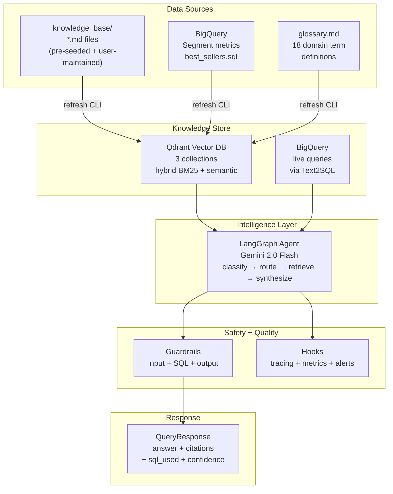
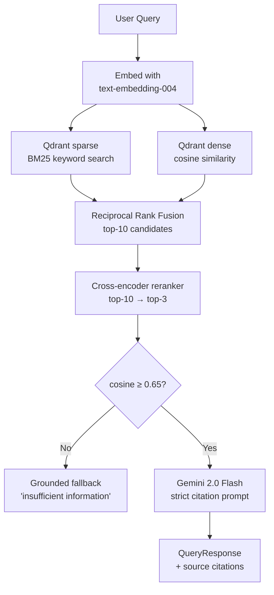
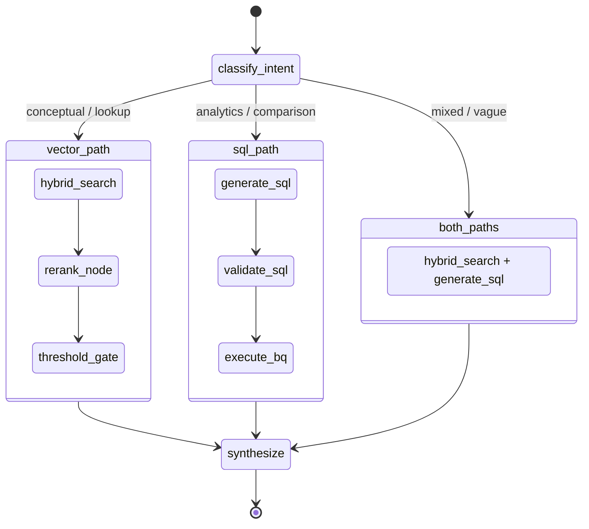

# Bestsellers Segment Intelligence System

## Why Not Pure RAG?

Pure RAG falls apart here because:
- Most high-value queries are **analytics** ("top segments by reach on TTD") — structured data, not prose
- Vague open-ended questions need **reasoning over multiple data types** simultaneously
- Segment descriptions are short; embedding alone loses numeric context

**Approach: Agentic RAG + Text2SQL routing (LangGraph)**. The agent classifies intent, routes to the right tool(s), and synthesizes a grounded, cited response.

---

## Framework Verdict

- **LlamaIndex**: Best pure-RAG library but weak for structured data agents. Not used as orchestrator.
- **LangChain**: Foundation library. Chains are rigid for multi-step conditional routing. Not used as orchestrator.
- **LangGraph**: Extension of LangChain for stateful multi-agent graphs. **This is the orchestrator.** Gives conditional edges, Gemini tool calling, conversation memory, debuggable state per node.

---

## Technology Stack

| Concern | Choice | Reason |
|---|---|---|
| Python | 3.13 | Latest stable, used via `uv` + `.venv` |
| Package manager | `uv` | Fast, lockfile-based, replaces pip/poetry |
| LLM | `gemini-2.0-flash` | Existing API key, best cost/quality ratio |
| Embeddings | `text-embedding-004` | Same API key, 768-dim, no extra cost |
| Vector store | `Qdrant` | Native hybrid BM25 + dense search, runs locally |
| Orchestration | `LangGraph` | Stateful agent graph, conditional routing |
| Structured data | `BigQuery` (live) | No data copy — query source of truth |
| Data models | `pydantic` v2 | All DTOs, config, LangGraph state |
| Config | `pydantic-settings` | `.env` loading with type validation |
| Logging | `structlog` | Structured JSON logs, no `print()` |
| Linting | `ruff` | Replaces flake8 + isort + black, Google docstrings |
| Type checking | `mypy --strict` | Full type safety |
| Evals | `ragas` | RAGAS faithfulness, context_recall, etc. |
| Tracing | `langsmith` | Optional — set via `.env` |

---

## Domain Knowledge — File-Based Approach

**Problem**: No Confluence API key available.

**Solution**: A file-based knowledge base at `knowledge_base/` with a refresh CLI.

```
knowledge_base/
├── activation.md          # What activation is, matching actions, SSA, digest, delivery modes
├── syndicated_segments.md # 3P/syndicated segments, field_id/value_id, seller/buyer model
├── platforms.md           # TTD, Google DV360, platform cookie overlap, Connect vs Data Store
├── delivery_stats.md      # segment_delivery_stats fields: num_total_audience_keys, etc.
├── reach_metrics.md       # cookie_reach, ios_reach, android_reach, input_records
├── distribution.md        # destination_account, active_buyers, distribution_rank
└── glossary.md            # 18 domain term definitions in structured format
```

**User workflow:**
1. Export a Confluence page → paste content into the relevant `.md` file in `knowledge_base/`
2. Run: `uv run python -m lr_bestsellers.ingestion.refresh`
3. The system re-embeds and upserts updated files into Qdrant

**Refresh CLI:**
```bash
# Re-ingest everything in knowledge_base/
uv run python -m lr_bestsellers.ingestion.refresh

# Re-ingest a specific file
uv run python -m lr_bestsellers.ingestion.refresh --file knowledge_base/activation.md

# Re-ingest and show what changed
uv run python -m lr_bestsellers.ingestion.refresh --verbose

# Re-ingest BigQuery segment catalog only
uv run python -m lr_bestsellers.ingestion.refresh --source bq

# Full reset (wipe Qdrant collections + re-ingest everything)
uv run python -m lr_bestsellers.ingestion.refresh --reset
```

Pre-seeded `.md` files are committed to the repo with high-quality domain content derived from the Confluence pages we've already read. Users extend them over time.

---

## System Architecture



---

## Three Qdrant Collections

### `segment_catalog`
- One document per segment from `best_sellers.sql` output
- Text: `Segment: {name}\nID: {id}\nDescription: {description}\nType: Syndicated`
- Payload: `dms_segment_id`, `seller_customer_id` (for filtering only)
- Metrics never stored here — always queried live from BigQuery

### `domain_knowledge`
- Parent-child hierarchical chunks from `knowledge_base/*.md` files
- Child chunks: ~300 tokens, prefixed with `[Doc: {filename} | Section: {h2} | Subsection: {h3}]`
- Parent section stored in payload as `parent_text` (returned to LLM, not indexed)
- Both dense (768-dim) + sparse (BM25) vectors per child

### `glossary`
- One document per domain term from `knowledge_base/glossary.md`
- Short, authoritative definitions — retrieved with highest priority
- Terms: `activation`, `syndicated segment`, `3P segment`, `SSA`, `digest`, `AIM mapping`,
  `cookie_reach`, `ios_reach`, `android_reach`, `cookie_overlap_percentage`,
  `FULL delivery`, `INCREMENTAL delivery`, `destination_account`, `field_id/value_id`,
  `deconfliction (AMC)`, `Connect platform`, `Data Marketplace`, `distribution_rank`, `reach_rank`

---

## Anti-Hallucination Retrieval Pipeline



---

## LangGraph Agent State Machine



LangGraph `AgentState` (TypedDict — immutable, nodes return partial updates):
```python
class AgentState(TypedDict):
    query: str
    intent: QueryIntent
    vector_results: list[SearchResult]
    sql_results: list[dict[str, Any]]
    final_answer: str
    sources: list[SourceCitation]
    sql_used: str | None
    confidence: float
```

---

## Guardrails

Three-layer validation. Any failure at input stage aborts before LLM call.

### Input (`guardrails/input.py`)
| Guardrail | Check | On fail |
|---|---|---|
| `LengthGuardrail` | `1 ≤ len ≤ 2000` | `QUERY_TOO_SHORT / LONG` |
| `PIIGuardrail` | Regex: emails, phones, SSNs | `PII_DETECTED` — never log raw query |
| `PromptInjectionGuardrail` | `ignore previous instructions`, `<\|im_start\|>`, etc. | `INJECTION_ATTEMPT` |
| `BannedTopicsGuardrail` | Configurable blocklist | `BANNED_TOPIC` |
| `RateLimitGuardrail` | Token bucket per caller | `RATE_LIMIT_EXCEEDED` |

### SQL (`guardrails/sql.py`)
| Guardrail | Check | On fail |
|---|---|---|
| `SelectOnlyGuardrail` | AST parse — SELECT only | `SQL_NOT_SELECT` |
| `TableAllowlistGuardrail` | Only permitted BQ tables | `DISALLOWED_TABLE` |
| `RowLimitGuardrail` | Auto-append `LIMIT 1000` | Auto-fix |
| `CostEstimationGuardrail` | BQ dry-run < 10 GB | `QUERY_TOO_EXPENSIVE` |

### Output (`guardrails/output.py`)
| Guardrail | Check | On fail |
|---|---|---|
| `CitationRequiredGuardrail` | Every claim has `[Source: ...]` | Regenerate (max 1 retry) |
| `ConfidenceGate` | `confidence ≥ 0.65` | Grounded fallback message |
| `NumberCrossCheckGuardrail` | Numbers in answer match BQ/retrieval data | `ANSWER_NUMBER_MISMATCH` |
| `HallucinationDetector` | Second Gemini faithfulness score ≥ 0.80 | Log `HALLUCINATION_RISK` + disclaimer |
| `PIIScrubber` | Scan output for PII | Redact before returning |

---

## Evals (RAGAS + custom)

| Metric | Target | Blocks CI |
|---|---|---|
| `faithfulness` | ≥ 0.90 | Yes |
| `context_recall` | ≥ 0.85 | Yes |
| `context_precision` | ≥ 0.80 | No |
| `answer_relevance` | ≥ 0.85 | No |
| `sql_validity_rate` | ≥ 0.95 | Yes |
| `intent_classification_accuracy` | ≥ 0.90 | No |

Eval datasets: `golden_queries.jsonl` (50 labelled), `retrieval_test_set.jsonl` (30), `sql_test_set.jsonl` (20), `adversarial_set.jsonl` (15).

```bash
uv run python tests/evals/run_evals.py --report   # full suite + HTML report
```

---

## Hooks

`SegmentIntelligenceCallbackHandler` registered in `RunnableConfig`. Fires on every node/tool/LLM call.

| Hook | Alert threshold |
|---|---|
| `on_threshold_failed` | > 20% of queries in 1h → knowledge gap alert |
| `on_guardrail_failed[injection]` | > 5 in 10 min → security alert |
| `on_hallucination_risk` | > 5% rate → quality regression alert |
| `on_sql_executed` | cost > 5 GB per query → cost alert |

---

## Engineering Standards (applies to ALL milestones)

Every file in every milestone must follow these without exception:

### Python version
```
python = "3.13"   # .python-version file + pyproject.toml requires-python = ">=3.13"
```

### Interpreter
Always use `.venv` managed by `uv`. Never use system Python or other venvs.

### Design patterns
- **Repository Pattern**: all I/O behind `*Repository` classes
- **Protocol-based interfaces** (`typing.Protocol`, not ABC) for `VectorStoreProtocol`, `IngestionSourceProtocol`
- **Pydantic v2** at every module boundary — no bare `dict` passing
- **Dependency injection** via `__init__` — no global singletons except `Settings`
- **Strategy Pattern** for retrieval — `HybridSearchStrategy` is default
- **Immutable LangGraph state** — `TypedDict`, nodes return partial dicts

### File structure
```
src/lr_bestsellers/    # source package (src layout, PEP 517)
tests/unit/            # pure unit tests, no I/O
tests/integration/     # require live Qdrant + BQ
tests/evals/           # AI quality evaluations
```

### Docstrings
**Google style on every public function/class/method:**
```python
def function(arg: str) -> list[Result]:
    """One-line summary.

    Longer description if needed.

    Args:
        arg: Description of arg.

    Returns:
        Description of return value.

    Raises:
        RetrievalError: When Qdrant is unreachable.

    Example:
        >>> function("hello")
        [Result(...)]
    """
```

### Logging
```python
log = structlog.get_logger(__name__)
log.info("node.start", node="classify_intent", query=query[:50])
log.info("node.complete", node="classify_intent", intent=intent, duration_ms=elapsed)
log.error("node.error", node="hybrid_search", error=str(exc))
# Never: print(), logging.info(), bare f-strings for debug
```

### Type annotations
- `from __future__ import annotations` at top of every file
- Full annotations on every function signature
- `Final` for constants, `Literal` for enums where appropriate
- `mypy --strict` must pass with zero errors

### Error handling
```python
# Never: except Exception: pass
# Always: catch specific, log with context, re-raise as domain exception
try:
    result = qdrant_client.search(...)
except Exception as exc:
    log.error("qdrant.search_failed", collection=collection, error=str(exc))
    raise RetrievalError(f"Qdrant search failed for collection {collection!r}") from exc
```

### Code style
```toml
[tool.ruff.lint.pydocstyle]
convention = "google"

[tool.mypy]
strict = true
python_version = "3.13"
```

### Commit scope
Each milestone is a clean, independently testable unit. Do not mix milestone code in one commit.

---

## Milestones

---

### MILESTONE 1 — Foundation
**Goal**: Project skeleton. No business logic. Everything else builds on top of this.
**Deliverables**:
- `pyproject.toml` — Python 3.13, all deps, `[tool.uv]`, `[tool.ruff]`, `[tool.mypy]`
- `.python-version` → `3.13`
- `.gitignore` — must include `.env`, `*.json` (prevents accidental SA key commits), `credentials/`, `.venv/`, `__pycache__/`, `*.pyc`, `.mypy_cache/`, `.ruff_cache/`, `tests/evals/results/`
- `.env.example` — all env vars documented with inline comments (see spec below)
- `src/lr_bestsellers/__init__.py` — re-exports `query`, `ingest` (stubbed)
- `src/lr_bestsellers/config.py` — `Settings(BaseSettings)` with all fields (see spec below)
- `src/lr_bestsellers/exceptions.py` — `BestSellersError` → `RetrievalError`, `EmbeddingError`, `SQLGenerationError`, `IngestionError`, `ThresholdNotMetError`, `GuardrailError`
- `src/lr_bestsellers/models/__init__.py`, `query.py`, `segment.py`, `chunk.py`
- `src/lr_bestsellers/utils/logging.py` — `configure_logging()`
- `AGENTS.md` — skeleton with coding standards (to be completed in M7)
- `tests/unit/test_models.py` — Pydantic model validation tests
- `tests/unit/test_config.py` — Settings loading tests

**`Settings` fields** (`src/lr_bestsellers/config.py`):
```python
# ── LLM ──────────────────────────────────────────────────────────
gemini_api_key: str                        # Google Gemini API key

# ── BigQuery ─────────────────────────────────────────────────────
# IMPORTANT: bq_project is the BILLING project (where query costs are charged),
# NOT the data project. Data tables are referenced by fully-qualified names
# inside best_sellers.sql (e.g. `liveramp-eng-pie.entities.*`).
# Set this to the GCP project whose credentials you have — e.g. liveramp-eng-qa-reliability.
bq_project: str

# Path to GCP service account JSON key file.
# When set: used as explicit credentials for the BigQuery client.
# When None: falls back to Application Default Credentials (ADC) automatically —
#   works on GCP-hosted infra (Cloud Run, GKE, Workload Identity) with no key file.
# NEVER commit the actual .json file to git — add it to .gitignore.
google_application_credentials: str | None = None

# ── Qdrant ───────────────────────────────────────────────────────
qdrant_url: str = "http://localhost:6333"
qdrant_api_key: str | None = None          # only needed for Qdrant Cloud

# ── Retrieval ────────────────────────────────────────────────────
similarity_threshold: float = 0.65        # min cosine score to pass threshold gate
top_k_retrieval: int = 10                 # candidates before reranking
top_k_final: int = 3                      # results after reranking sent to LLM

# ── Logging ──────────────────────────────────────────────────────
log_level: str = "INFO"
log_format: str = "console"               # "console" for dev, "json" for prod

# ── LangSmith tracing (optional) ─────────────────────────────────
langchain_tracing_v2: bool = False
langchain_api_key: str | None = None
langchain_project: str = "lr-bestsellers"
```
Use `model_config = SettingsConfigDict(env_file=".env", env_file_encoding="utf-8")`.
Provide `get_settings()` with `@lru_cache` returning a cached singleton.

**`.env.example`** contents:
```bash
# ── LLM ──────────────────────────────────────────────────────────
GEMINI_API_KEY=your-gemini-api-key-here

# ── BigQuery ─────────────────────────────────────────────────────
# Billing project — the GCP project whose quota/costs cover these queries.
# The actual data tables live in liveramp-eng-pie (hardcoded in best_sellers.sql).
# Use the project whose service account JSON you have access to.
BQ_PROJECT=liveramp-eng-qa-reliability

# Path to your GCP service account JSON key file (local dev only).
# On GCP-hosted infra (Cloud Run, GKE), leave unset — ADC handles auth automatically.
# NEVER commit the actual .json file to git.
GOOGLE_APPLICATION_CREDENTIALS=/Users/yourname/.gcp/lr-bestsellers-sa.json

# ── Qdrant ───────────────────────────────────────────────────────
QDRANT_URL=http://localhost:6333
# QDRANT_API_KEY=                         # only for Qdrant Cloud

# ── Retrieval ────────────────────────────────────────────────────
SIMILARITY_THRESHOLD=0.65
TOP_K_RETRIEVAL=10
TOP_K_FINAL=3

# ── Logging ──────────────────────────────────────────────────────
LOG_LEVEL=INFO
LOG_FORMAT=console                        # "console" for dev, "json" for prod

# ── LangSmith tracing (optional) ─────────────────────────────────
# LANGCHAIN_TRACING_V2=true
# LANGCHAIN_API_KEY=your-langsmith-key
# LANGCHAIN_PROJECT=lr-bestsellers
```

**Test command**: `uv run pytest tests/unit/ -v`
**Depends on**: nothing

---

### MILESTONE 2 — Storage Layer
**Goal**: Qdrant repository, fully tested in isolation with a local Qdrant instance.
**Deliverables**:
- `docker-compose.yml` — Qdrant local dev setup
- `src/lr_bestsellers/store/protocols.py` — `VectorStoreProtocol(Protocol)` with `upsert`, `hybrid_search`, `delete`, `collection_exists`
- `src/lr_bestsellers/store/qdrant.py` — `QdrantRepository` implementing protocol, managing 3 collections
- `tests/unit/test_store_protocol.py` — protocol conformance with a mock
- `tests/integration/test_qdrant.py` — live Qdrant tests (upsert → search → delete)

**Test command**: `uv run pytest tests/unit/ tests/integration/test_qdrant.py -v`
**Depends on**: M1 (models, config, exceptions)

---

### MILESTONE 3 — Ingestion Pipeline
**Goal**: All three ingestion sources populate Qdrant. Refresh CLI works end-to-end.
**Deliverables**:
- `knowledge_base/` — 7 pre-seeded `.md` files with LiveRamp domain content
- `src/lr_bestsellers/ingestion/protocols.py` — `IngestionSourceProtocol`
- `src/lr_bestsellers/ingestion/file_ingestion.py` — `FileIngestionSource` (reads `knowledge_base/*.md`, parent-child chunks)
- `src/lr_bestsellers/ingestion/bq_fetcher.py` — `BigQueryIngestionSource` (runs `best_sellers.sql`)
- `src/lr_bestsellers/ingestion/glossary_builder.py` — `GlossaryIngestionSource` (parses `knowledge_base/glossary.md`)
- `src/lr_bestsellers/utils/chunking.py` — `ParentChildChunker` with header injection
- `src/lr_bestsellers/utils/reranker.py` — `CrossEncoderReranker`
- `src/lr_bestsellers/__main__.py` — `refresh` CLI with flags `--file`, `--source`, `--reset`, `--verbose`
- `tests/unit/test_chunking.py` — chunker unit tests
- `tests/unit/test_ingestion.py` — file ingestion with fixture markdown
- `tests/integration/test_bq.py` — BigQuery connectivity test

**BigQuery client construction** (in `bq_fetcher.py`):
```python
# bq_project  = BILLING project (e.g. liveramp-eng-qa-reliability)
#               This is the project whose quota/costs cover the query.
#               It matches what you select in the BigQuery UI project dropdown.
#
# Data tables  = referenced by fully-qualified names inside best_sellers.sql
#               (e.g. `liveramp-eng-pie.entities.fin_marketplace_segments`)
#               These never change — no config needed for them.

if settings.google_application_credentials:
    credentials = service_account.Credentials.from_service_account_file(
        settings.google_application_credentials,
        scopes=["https://www.googleapis.com/auth/bigquery.readonly"],  # least privilege
    )
    client = bigquery.Client(project=settings.bq_project, credentials=credentials)
else:
    # ADC fallback — works automatically on GCP-hosted infra (Cloud Run, GKE, Workload Identity)
    client = bigquery.Client(project=settings.bq_project)
```
The service account only needs `bigquery.jobs.create` on `bq_project` and `bigquery.tables.getData` on the source tables in `liveramp-eng-pie` and `corp-bi-us-prod` — cross-project access that is already granted if the query runs in the BigQuery UI with this project selected.

**Test command**: `uv run pytest tests/unit/ -v`
**Refresh command**: `uv run python -m lr_bestsellers refresh`
**Depends on**: M1 + M2

---

### MILESTONE 4 — Agent Core
**Goal**: `query(text)` works end-to-end. Ask a question, get a grounded answer.
**Deliverables**:
- `src/lr_bestsellers/agent/prompts.py` — `CLASSIFY_INTENT_PROMPT`, `SYNTHESIZE_PROMPT`, `TEXT2SQL_PROMPT` as typed `Final[str]` constants
- `src/lr_bestsellers/agent/tools.py` — `hybrid_search_tool`, `text2sql_exec_tool`, `glossary_lookup_tool` using `@tool` + Pydantic input schemas
- `src/lr_bestsellers/agent/nodes.py` — pure node functions: `classify_intent`, `run_hybrid_search`, `run_text2sql`, `rerank_results`, `threshold_gate`, `synthesize`
- `src/lr_bestsellers/agent/graph.py` — `AgentState(TypedDict)` + compiled `StateGraph`
- `main.py` — `query(text: str, settings: Settings | None = None) -> QueryResponse` + `if __name__ == "__main__"` CLI
- `tests/unit/test_nodes.py` — node functions with mocked dependencies
- `tests/unit/test_tools.py` — tool input schema validation

**Test command**: `uv run pytest tests/unit/ -v`
**Run command**: `uv run python main.py "What are the top segments by cookie reach?"`
**Depends on**: M1 + M2 + M3

---

### MILESTONE 5 — Guardrails
**Goal**: No bad input reaches the LLM. No bad output reaches the caller.
**Deliverables**:
- `src/lr_bestsellers/guardrails/base.py` — `GuardrailResult(BaseModel)`, `GuardrailChain`, `Guardrail(Protocol)`
- `src/lr_bestsellers/guardrails/input.py` — `LengthGuardrail`, `PIIGuardrail`, `PromptInjectionGuardrail`, `BannedTopicsGuardrail`, `RateLimitGuardrail`
- `src/lr_bestsellers/guardrails/sql.py` — `SelectOnlyGuardrail`, `TableAllowlistGuardrail`, `RowLimitGuardrail`, `CostEstimationGuardrail`
- `src/lr_bestsellers/guardrails/output.py` — `CitationRequiredGuardrail`, `ConfidenceGate`, `NumberCrossCheckGuardrail`, `HallucinationDetector`, `PIIScrubber`
- Guardrails wired into `main.py` (input before graph, output after graph)
- `tests/unit/test_guardrails.py` — pass/fail cases for every single guardrail

**Test command**: `uv run pytest tests/unit/test_guardrails.py -v`
**Depends on**: M1 + M4 (for `QueryRequest`/`QueryResponse` models and graph)

---

### MILESTONE 6 — Observability
**Goal**: Every agent step is traced. Regressions are caught by evals. Alerts fire on quality drops.
**Deliverables**:
- `src/lr_bestsellers/hooks/callbacks.py` — `SegmentIntelligenceCallbackHandler` (LangGraph `BaseCallbackHandler`)
- `src/lr_bestsellers/hooks/metrics.py` — counters, histograms, alert threshold checks
- Hooks wired into `RunnableConfig` in `agent/graph.py`
- `tests/evals/datasets/golden_queries.jsonl` — 50 hand-labelled queries
- `tests/evals/datasets/retrieval_test_set.jsonl` — 30 retrieval ground-truth pairs
- `tests/evals/datasets/sql_test_set.jsonl` — 20 SQL ground-truth pairs
- `tests/evals/datasets/adversarial_set.jsonl` — 15 adversarial queries
- `tests/evals/test_retrieval_eval.py` — RAGAS `context_recall` + `context_precision`
- `tests/evals/test_generation_eval.py` — RAGAS `faithfulness` + `answer_relevance`
- `tests/evals/test_sql_eval.py` — SQL validity + accuracy
- `tests/evals/test_guardrails_eval.py` — adversarial guardrail coverage
- `tests/evals/run_evals.py` — full eval runner, saves `results/YYYY-MM-DD.json`, exits non-zero if CI thresholds missed

**Test command**: `uv run pytest tests/unit/ -v && uv run python tests/evals/run_evals.py`
**Depends on**: M1–M5

---

### MILESTONE 7 — Documentation
**Goal**: Production-ready docs. Both `README.md` and `AGENTS.md` complete and accurate.
**Deliverables**:
- `README.md` — full dual-audience documentation:
  - Plain English intro (non-technical)
  - High-level architecture mermaid
  - Ingestion pipeline mermaid
  - Retrieval + anti-hallucination pipeline mermaid
  - LangGraph state machine mermaid
  - Storage layer mermaid
  - Quick start (5 commands to get running)
  - `.env` config reference table
  - Query examples table
  - Development commands (ruff, mypy, pytest, evals)
- `AGENTS.md` — complete AI agent guide:
  - Codebase map (one-line per file)
  - Non-negotiable invariants
  - How to add a new tool
  - How to add a new ingestion source
  - How to add a new guardrail
  - How to add a glossary term
  - Test + lint commands

**Depends on**: M1–M6 (final state of all code must match the docs)

---

## Final Project Structure

```
lr_bestsellers/
├── README.md
├── AGENTS.md
├── best_sellers.sql
├── main.py                                  # query() + CLI entry point
├── docker-compose.yml                       # Qdrant local dev
├── .env.example
├── .gitignore                               # .env, *.json, credentials/, .venv/, __pycache__/
├── .python-version                          # 3.13
├── pyproject.toml
│
├── knowledge_base/
│   ├── activation.md
│   ├── syndicated_segments.md
│   ├── platforms.md
│   ├── delivery_stats.md
│   ├── reach_metrics.md
│   ├── distribution.md
│   └── glossary.md
│
├── src/lr_bestsellers/
│   ├── __init__.py                          # re-exports: query(), ingest()
│   ├── __main__.py                          # refresh CLI
│   ├── config.py                            # Settings(BaseSettings)
│   ├── exceptions.py                        # BestSellersError hierarchy
│   │
│   ├── models/
│   │   ├── __init__.py
│   │   ├── query.py                         # QueryRequest, QueryResponse, QueryIntent
│   │   ├── segment.py                       # SegmentDocument
│   │   └── chunk.py                         # ChildChunk, ParentChunk, SearchResult, SourceCitation
│   │
│   ├── store/
│   │   ├── __init__.py
│   │   ├── protocols.py                     # VectorStoreProtocol
│   │   └── qdrant.py                        # QdrantRepository
│   │
│   ├── ingestion/
│   │   ├── __init__.py
│   │   ├── protocols.py                     # IngestionSourceProtocol
│   │   ├── file_ingestion.py                # FileIngestionSource (knowledge_base/*.md)
│   │   ├── bq_fetcher.py                    # BigQueryIngestionSource
│   │   └── glossary_builder.py              # GlossaryIngestionSource
│   │
│   ├── agent/
│   │   ├── __init__.py
│   │   ├── graph.py                         # AgentState TypedDict + compiled graph
│   │   ├── nodes.py                         # pure node functions
│   │   ├── tools.py                         # @tool definitions + Pydantic input schemas
│   │   └── prompts.py                       # Final[str] prompt constants
│   │
│   ├── guardrails/
│   │   ├── __init__.py
│   │   ├── base.py                          # GuardrailResult, GuardrailChain, Guardrail Protocol
│   │   ├── input.py
│   │   ├── sql.py
│   │   └── output.py
│   │
│   ├── hooks/
│   │   ├── __init__.py
│   │   ├── callbacks.py                     # SegmentIntelligenceCallbackHandler
│   │   └── metrics.py                       # counters, histograms, alert checks
│   │
│   └── utils/
│       ├── __init__.py
│       ├── chunking.py                      # ParentChildChunker
│       ├── reranker.py                      # CrossEncoderReranker
│       └── logging.py                       # configure_logging()
│
└── tests/
    ├── conftest.py                           # shared fixtures
    ├── unit/
    │   ├── test_models.py
    │   ├── test_config.py
    │   ├── test_chunking.py
    │   ├── test_guardrails.py
    │   ├── test_nodes.py
    │   ├── test_tools.py
    │   └── test_store_protocol.py
    ├── integration/
    │   ├── test_qdrant.py
    │   └── test_bq.py
    └── evals/
        ├── datasets/
        │   ├── golden_queries.jsonl
        │   ├── retrieval_test_set.jsonl
        │   ├── sql_test_set.jsonl
        │   └── adversarial_set.jsonl
        ├── test_retrieval_eval.py
        ├── test_generation_eval.py
        ├── test_sql_eval.py
        ├── test_guardrails_eval.py
        └── run_evals.py
```

---

## Dependencies (`pyproject.toml`)

```toml
[project]
name = "lr-bestsellers"
version = "0.1.0"
requires-python = ">=3.13"
dependencies = [
    "langchain-google-genai>=2.0",
    "langgraph>=0.2",
    "langchain-qdrant>=0.2",
    "qdrant-client>=1.9",
    "google-cloud-bigquery>=3.0",
    "langchain-community>=0.3",
    "pydantic>=2.7",
    "pydantic-settings>=2.3",
    "structlog>=24.0",
    "ragas>=0.1",
    "langsmith>=0.1",
]

[project.optional-dependencies]
api = ["fastapi>=0.111", "uvicorn[standard]>=0.29"]

[tool.uv]
dev-dependencies = [
    "ruff>=0.4",
    "mypy>=1.10",
    "pytest>=8.0",
    "pytest-asyncio>=0.23",
]

[tool.ruff]
target-version = "py313"
line-length = 100

[tool.ruff.lint]
select = ["E", "F", "I", "N", "UP", "ANN", "D"]
ignore = ["D100", "D104"]

[tool.ruff.lint.pydocstyle]
convention = "google"

[tool.mypy]
strict = true
python_version = "3.13"
```
