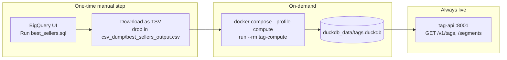
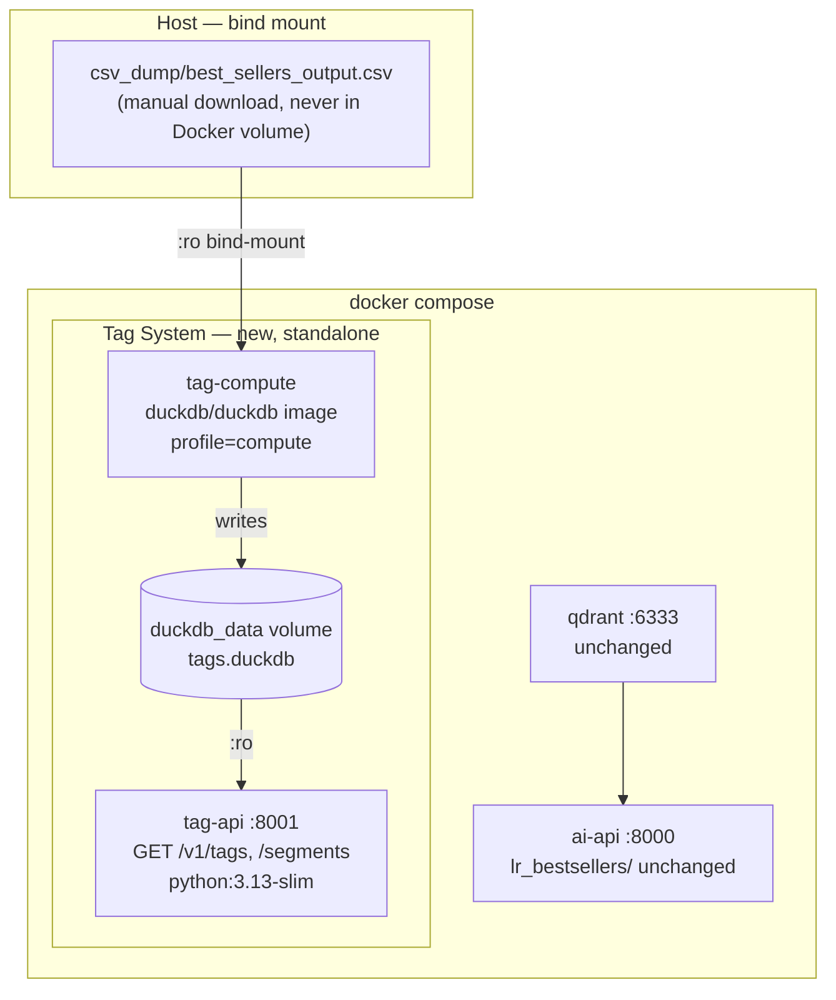

# Segment Tag Labeling System — Hackathon (Local) Plan

---

## What Are We Building?

A backend system that automatically attaches recommendation tags to segments — like Amazon's "Best Seller" and "#1 in Category" badges. Tags are pre-computed from BigQuery data, stored in DuckDB, and served via a lightweight FastAPI on port 8001. Zero AI, zero secrets, zero connection to the existing AI/RAG app.

---

## End-to-End Flow



- **Manual (once)**: Someone with BigQuery access runs `best_sellers.sql`, downloads the TSV, drops it in `csv_dump/`. Share the file with the team — nobody else needs BigQuery access.
- **On-demand**: `docker compose --profile compute run --rm tag-compute` reads the CSV and rebuilds `tags.duckdb`. Re-run whenever the CSV is refreshed.
- **Always live**: `tag-api` reads `tags.duckdb` and serves `GET /v1/tags`, `GET /v1/segments` (paginated dump rows + tags), plus per-segment and per-tag lookups. No BigQuery, no secrets, no AI.

---

## What Is NOT in This System

- No LLM, Gemini, or any AI model
- No real-time BigQuery calls at query time
- No secrets or API keys to serve tags
- No code shared with `lr_bestsellers/` — the existing AI/RAG app is untouched

---

## Data Source — `best_sellers.sql`

The BigQuery export from `best_sellers.sql` is a **tab-separated file with 22 columns**. Confirmed from `query_results.csv` (321-row partial sample):

| Column | Type | Used for |
|---|---|---|
| `dms_segment_id` | BIGINT | Primary key |
| `active_platform_names` | VARCHAR | Platform tag matching (comma-space delimited: `"Facebook, MNTN, The Trade Desk"`) |
| `active_platforms` | INTEGER | Multi-platform count tags |
| `active_buyers` | INTEGER | Buyer adoption tag |
| `active_destination_accounts` | INTEGER | Distribution tag |
| `cookie_reach` | BIGINT | Cookie scale tag |
| `ios_reach` | BIGINT | iOS reach tag |
| `android_reach` | BIGINT | Android reach tag |
| `is_highly_distributed` | BOOLEAN | Pass-through + gate for platform tags |
| `is_highly_reachable` | BOOLEAN | Available for future tags |
| `is_top_n_by_reach` | BOOLEAN | Available for future tags |
| `distribution_rank`, `reach_rank` | INTEGER | Available for future tags |

**Confirmed platform names in the data**: Facebook, The Trade Desk, `Google | Data Marketplace` (NOT "DV360"), MNTN, Amazon, Xandr, TikTok, etc.

### Two existing CSV files — why only one is usable

| File | Rows | Columns | Use |
|---|---|---|---|
| `dms_segments_best_sellers.csv` | 1.1M | 4 — id, seller, name, description | Qdrant text search only. No metrics. Cannot compute tags. |
| `csv_dump/best_sellers_output.csv` | top segments | 22 — full metrics | **Tag computation input.** |

---

## 11 Computable Tags

These are the only tags available from `best_sellers.sql`. The 4 revenue/impressions tags (`TOP_IMPRESSIONS`, `HIGH_REVENUE_PERFORMER`, `BESTSELLER`, `PREMIUM_DATA`) require columns not present in `best_sellers.sql` and are deferred post-hackathon.

| Tag slug | Category | Logic |
|---|---|---|
| `top_facebook_activated` | platform | `'Facebook' IN split(active_platform_names, ', ')` AND `is_highly_distributed` |
| `top_ttd_activated` | platform | `'The Trade Desk' IN split(...)` AND `is_highly_distributed` |
| `top_google_activated` | platform | `'Google \| Data Marketplace' IN split(...)` AND `is_highly_distributed` |
| `multi_platform_powerhouse` | platform | `active_platforms >= 5` |
| `high_ios_reach` | reach | `ios_reach >= p90(ios_reach)` |
| `high_android_reach` | reach | `android_reach >= p90(android_reach)` |
| `massive_cookie_scale` | reach | `cookie_reach >= p99(cookie_reach)` |
| `cross_device_champion` | reach | all three reach columns >= p80 simultaneously |
| `highly_distributed` | distribution | `is_highly_distributed = true` pass-through |
| `buyer_magnet` | distribution | `active_buyers >= p90(active_buyers)` |
| `broad_platform_breadth` | distribution | `active_platforms >= 4` |

---

## Docker Architecture



### Credentials boundary

| Service | `.env` | GCP creds |
|---|---|---|
| `qdrant` | No | No |
| `tag-compute` | **No** | **No** — reads local CSV only |
| `tag-api` | **No** | **No** — reads `tags.duckdb` only |
| `ai-api` (unchanged) | Yes | Optional |

---

## Component Design

### 1. `docker-compose.yml` — additions to existing file

```yaml
  tag-compute:
    image: duckdb/duckdb
    volumes:
      - ./csv_dump:/workspace/csv_dump:ro
      - ./compute_tags.sql:/workspace/compute_tags.sql:ro
      - duckdb_data:/workspace/data
    working_dir: /workspace
    command: ["/workspace/data/tags.duckdb", ".read /workspace/compute_tags.sql"]
    profiles: ["compute"]

  tag-api:
    build: ./tag_api
    ports: ["8001:8001"]
    volumes:
      - duckdb_data:/app/duckdb_data:ro
    environment:
      TAGS_DUCKDB_PATH: /app/duckdb_data/tags.duckdb
    restart: unless-stopped

volumes:
  qdrant_storage:   # existing
  duckdb_data:      # new
# csv_dump/ is a plain host directory (bind-mount above) — not a named volume
```

---

### 2. `compute_tags.sql` — all tag logic in pure SQL

Executed by the `duckdb/duckdb` CLI image. No Python required for the compute step.

```sql
-- Step 1: Load the tab-separated BigQuery export
CREATE OR REPLACE VIEW raw AS
SELECT * FROM read_csv(
  '/workspace/csv_dump/best_sellers_output.csv',
  delim='\t',
  header=true,
  quote='"'
);

-- Step 2: Compute p90/p99/p80 thresholds in a single pass
-- Only columns that exist in best_sellers.sql output
CREATE OR REPLACE TABLE thresholds AS
SELECT
  PERCENTILE_CONT(0.90) WITHIN GROUP (ORDER BY ios_reach)
    FILTER (WHERE ios_reach > 0)        AS ios_reach_p90,
  PERCENTILE_CONT(0.90) WITHIN GROUP (ORDER BY android_reach)
    FILTER (WHERE android_reach > 0)    AS android_reach_p90,
  PERCENTILE_CONT(0.99) WITHIN GROUP (ORDER BY cookie_reach)
    FILTER (WHERE cookie_reach > 0)     AS cookie_reach_p99,
  PERCENTILE_CONT(0.90) WITHIN GROUP (ORDER BY active_buyers)
                                        AS buyers_p90,
  PERCENTILE_CONT(0.80) WITHIN GROUP (ORDER BY ios_reach)
    FILTER (WHERE ios_reach > 0)        AS ios_p80,
  PERCENTILE_CONT(0.80) WITHIN GROUP (ORDER BY android_reach)
    FILTER (WHERE android_reach > 0)    AS android_p80,
  PERCENTILE_CONT(0.80) WITHIN GROUP (ORDER BY cookie_reach)
    FILTER (WHERE cookie_reach > 0)     AS cookie_p80
FROM raw;

-- Step 3: Evaluate all 11 tag rules per segment
-- active_platform_names format: "Facebook, MNTN, The Trade Desk" (comma-space)
CREATE OR REPLACE TABLE tagged AS
SELECT
  r.dms_segment_id AS segment_id,
  -- Platform Activation
  (list_contains(string_split(r.active_platform_names, ', '), 'Facebook')
    AND r.is_highly_distributed)                             AS top_facebook_activated,
  (list_contains(string_split(r.active_platform_names, ', '), 'The Trade Desk')
    AND r.is_highly_distributed)                             AS top_ttd_activated,
  (list_contains(string_split(r.active_platform_names, ', '), 'Google | Data Marketplace')
    AND r.is_highly_distributed)                             AS top_google_activated,
  (r.active_platforms >= 5)                                  AS multi_platform_powerhouse,
  -- Reach
  (r.ios_reach     >= t.ios_reach_p90)                       AS high_ios_reach,
  (r.android_reach >= t.android_reach_p90)                   AS high_android_reach,
  (r.cookie_reach  >= t.cookie_reach_p99)                    AS massive_cookie_scale,
  (r.ios_reach     >= t.ios_p80
    AND r.android_reach >= t.android_p80
    AND r.cookie_reach  >= t.cookie_p80)                     AS cross_device_champion,
  -- Distribution
  r.is_highly_distributed                                     AS highly_distributed,
  (r.active_buyers >= t.buyers_p90)                          AS buyer_magnet,
  (r.active_platforms >= 4)                                  AS broad_platform_breadth
FROM raw r CROSS JOIN thresholds t;

-- Step 4: Write tag_definitions (11 rows — only tags computable from best_sellers.sql)
CREATE OR REPLACE TABLE tag_definitions AS
SELECT * FROM (VALUES
  ('top_facebook_activated',   'Top Facebook Activated',    'Top 10% distributed on Facebook',               'platform', 1),
  ('top_ttd_activated',        'Top TTD Activated',         'Top 10% distributed on The Trade Desk',         'platform', 2),
  ('top_google_activated',     'Top Google Activated',      'Top 10% on Google | Data Marketplace',          'platform', 3),
  ('multi_platform_powerhouse','Multi-Platform Powerhouse', 'Active on 5+ ad platforms',                     'platform', 4),
  ('high_ios_reach',           'High iOS Reach',            'Top 10% by iOS device reach',                   'reach',    5),
  ('high_android_reach',       'High Android Reach',        'Top 10% by Android device reach',               'reach',    6),
  ('massive_cookie_scale',     'Massive Cookie Scale',      'Top 1% by cookie reach',                        'reach',    7),
  ('cross_device_champion',    'Cross-Device Champion',     'Top 20% on cookie, iOS, and Android reach',     'reach',    8),
  ('highly_distributed',       'Highly Distributed',        'Top 10% by destination accounts',               'distribution', 9),
  ('buyer_magnet',             'Buyer Magnet',              'Top 10% by active buyers',                      'distribution', 10),
  ('broad_platform_breadth',   'Broad Platform Breadth',    'Active on 4+ ad platforms',                     'distribution', 11)
) t(tag_key, display_name, description, category, priority);

-- Step 5: Unpivot to segment_tag_assignments (one row per segment-tag pair)
CREATE OR REPLACE TABLE segment_tag_assignments AS
SELECT segment_id, tag_key, 1.0 AS score, current_timestamp::VARCHAR AS computed_at
FROM tagged
UNPIVOT (is_tagged FOR tag_key IN (
  top_facebook_activated, top_ttd_activated, top_google_activated, multi_platform_powerhouse,
  high_ios_reach, high_android_reach, massive_cookie_scale, cross_device_champion,
  highly_distributed, buyer_magnet, broad_platform_breadth
))
WHERE is_tagged = true;

-- Step 6: Build inverted index (tag → list of segment IDs)
CREATE OR REPLACE TABLE tag_segment_index AS
SELECT tag_key, segment_id, score FROM segment_tag_assignments;

CREATE INDEX IF NOT EXISTS idx_sta_seg ON segment_tag_assignments(segment_id);
CREATE INDEX IF NOT EXISTS idx_tsi_tag ON tag_segment_index(tag_key, score DESC);
```

Adding a new tag = one new column in `tagged` + one VALUES row in `tag_definitions` + one entry in UNPIVOT. Zero Python changes.

---

### 3. `tag_api/` — standalone Python project

Completely independent from `lr_bestsellers/`. No shared code, no shared Python packages.

```
tag_api/
├── Dockerfile
├── pyproject.toml      # fastapi, uvicorn[standard], duckdb, pydantic, structlog ONLY
├── uv.lock
├── main.py             # create_app() + lifespan (open DuckDB once, close on shutdown)
├── config.py           # Settings(BaseSettings): TAGS_DUCKDB_PATH
├── models.py           # TagDefinition, SegmentRow, SegmentsPage, TagsPage
├── store.py            # TagStoreProtocol + DuckDbTagStore + EmptyTagStore (Null Object)
├── routes.py           # GET /v1/tags, /segments, /segments/{id}/tags, /tags/{slug}/segments
├── dependencies.py     # get_tag_store() — @lru_cache(maxsize=1) singleton
├── exceptions.py       # TagStoreError, TagNotFoundError
└── tests/
    ├── conftest.py     # in-memory DuckDB fixture pre-seeded with 3 tags × 5 segments
    ├── test_store.py
    ├── test_routes.py
    └── test_models.py
```

**`tag_api/Dockerfile`**:
```dockerfile
FROM python:3.13-slim
RUN pip install uv --no-cache-dir
WORKDIR /app
COPY pyproject.toml uv.lock* ./
RUN uv sync --frozen --no-dev
COPY . .
CMD ["uv", "run", "uvicorn", "main:app", "--host", "0.0.0.0", "--port", "8001"]
```

**`tag_api/pyproject.toml`** — no LangGraph, no google-cloud-*, no qdrant-client:
```toml
[project]
name = "lr-tag-api"
version = "0.1.0"
requires-python = ">=3.13"
dependencies = [
    "fastapi>=0.111",
    "uvicorn[standard]>=0.29",
    "duckdb>=1.0",
    "pydantic>=2.7",
    "pydantic-settings>=2.0",
    "structlog>=24.0",
]
```

**`TagStoreProtocol`** (4 methods — Interface Segregation):
```python
class TagStoreProtocol(Protocol):
    def get_tags_for_segment(self, segment_id: int) -> list[TagDefinition]: ...
    def get_segments_for_tag(self, slug: str, page: int, size: int) -> TagsPage: ...
    def list_segments(self, page: int, size: int) -> SegmentsPage: ...
    def list_tags(self) -> list[TagDefinition]: ...
```

`DuckDbTagStore` opens `tags.duckdb` once with `read_only=True` in the FastAPI `lifespan`. `EmptyTagStore` returns empty lists when the DB file doesn't exist yet (Null Object — API starts cleanly without tags).

**API endpoints**:
- `GET /v1/tags` → list all 11 tag definitions
- `GET /v1/segments?page=1&size=50` → paginated `segment_dump` rows, each with assigned tags
- `GET /v1/segments/{segment_id}/tags` → all tags for a given segment
- `GET /v1/tags/{slug}/segments?page=1&size=50` → paginated segment IDs for a tag

---

## Files to Create / Modify

```
# New — standalone tag system
compute_tags.sql                      # repo root — DuckDB CLI tag computation
tag_api/
  Dockerfile
  pyproject.toml
  uv.lock
  main.py
  config.py
  models.py
  store.py
  routes.py
  dependencies.py
  exceptions.py
  tests/
    conftest.py
    test_store.py
    test_routes.py
    test_models.py

# Modified — existing repo
docker-compose.yml                    # add tag-compute + tag-api + duckdb_data volume
.gitignore                            # add tag_api/.venv, csv_dump/best_sellers_output.csv
README.md                             # add quick-start section + tag table + API endpoints
AGENTS.md                             # update codebase map section 3 with tag_api/
```

`lr_bestsellers/` — **not modified at all**.

---

## Setup for Any Team Member

```bash
# 1. Clone
git clone <repo>

# 2. Get the CSV (ask whoever has BigQuery access — they run best_sellers.sql and export as TSV)
#    Save it as:
mv ~/Downloads/your_export.csv csv_dump/best_sellers_output.csv

# 3. Compute tags (~30 seconds)
docker compose --profile compute run --rm tag-compute

# 4. Start the tag API
docker compose up -d tag-api

# 5. Verify
curl http://localhost:8001/v1/tags
curl "http://localhost:8001/v1/segments?page=1&size=10"
curl http://localhost:8001/v1/segments/1015151361/tags
curl "http://localhost:8001/v1/tags/high_ios_reach/segments?page=1&size=10"
```

Zero local Python installs. Zero secrets.

---

## Engineering Standards

### SOLID

- **Single Responsibility**: `compute_tags.sql` computes tags. `DuckDbTagStore` reads tags. `routes.py` handles HTTP. `models.py` defines shapes.
- **Open/Closed**: Add a tag by editing `compute_tags.sql` only — zero Python changes, zero Docker rebuild.
- **Liskov Substitution**: `EmptyTagStore` and `DuckDbTagStore` are fully interchangeable via `TagStoreProtocol`.
- **Interface Segregation**: `TagStoreProtocol` has four methods.
- **Dependency Inversion**: Routes depend on `TagStoreProtocol`, injected via `Depends(get_tag_store)`.

### Design Patterns

- **Repository Pattern** — `DuckDbTagStore` owns all SQL; callers never write queries.
- **Null Object** — `EmptyTagStore` prevents startup crash when `tags.duckdb` doesn't exist.
- **Singleton via lifespan** — DuckDB connection opened once in `lifespan`, stored in `app.state`, closed on shutdown. Never opened per request.

### Memory Leak Prevention

- One DuckDB connection per process, opened in `lifespan`, closed on shutdown.
- `read_only=True` prevents accidental writes from API process.
- `@lru_cache(maxsize=1)` on `get_tag_store()` — bounded singleton.
- `pathlib.Path` for all file paths.

### Unit Tests (≥ 90% coverage on all new files)

- **`conftest.py`**: in-memory DuckDB seeded with 3 tag_definitions + 5 segment_tag_assignments + 5 tag_segment_index rows
- **`test_store.py`**: `get_tags_for_segment` hit/miss, `get_segments_for_tag` pagination, `list_segments` pagination, `list_tags` ordering, missing-file graceful degradation
- **`test_routes.py`**: all 4 endpoints happy path + 404 + 503, `dependency_overrides` with Mock — no real DuckDB in route tests
- **`test_models.py`**: Pydantic validation edge cases
- **`test_compute_sql.py`** (in existing `tests/unit/`): load `compute_tags.sql` into `:memory:` DuckDB with 5-row fixture CSV, assert `tag_definitions` has exactly **11 rows**, assert `top_facebook_activated` fires only when Facebook is present AND `is_highly_distributed`, assert `cross_device_champion` requires all three reach columns above p80

### Pre-Merge Checklist

```bash
cd tag_api
uv run ruff check .
uv run ruff format --check .
uv run mypy .
uv run pytest tests/ -v --tb=short --cov=. --cov-report=term-missing

cd ..
uv run pytest tests/unit/test_compute_sql.py -v
docker compose build tag-api
docker compose --profile compute run --rm tag-compute
```

---

## Path to Production (Post-Hackathon)

| Hackathon | Production swap-in |
|---|---|
| `compute_tags.sql` via `duckdb/duckdb` image | Dataproc Spark job calling the same SQL logic |
| `tags.duckdb` on Docker volume | Cloud Bigtable |
| `TagStoreProtocol` → `DuckDbTagStore` | Same protocol → `BigtableTagStore` |
| FastAPI on port 8001 | gRPC `TagService` + grpc-gateway |
| Manual CSV download | BigQuery materialized views + Cloud Composer DAG |
| `@lru_cache` in-process | Cloud Memorystore Redis |
