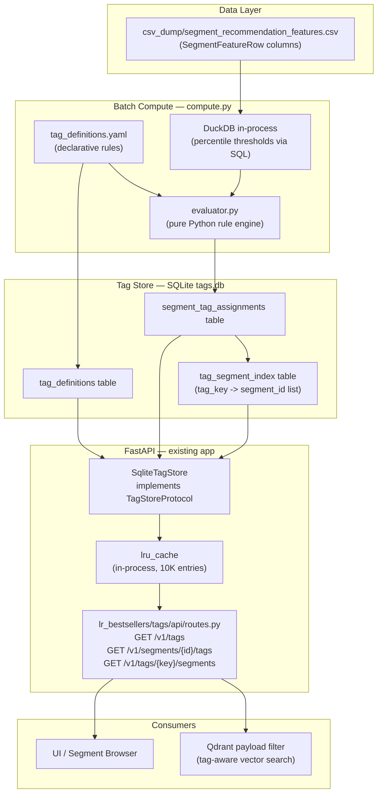

# Segment Tag Labeling System — Hackathon (Local) Plan

## Problem Scope

`SegmentFeatureRow` (from `csv_dump/segment_recommendation_features.csv`) already carries every metric needed to compute tags:

- **Reach**: `cookie_reach`, `ios_reach`, `android_reach` (from `query_results.csv` / BigQuery dump)
- **Distribution**: `active_destination_accounts`, `active_buyers`, `active_distribution_platforms`, `active_platform_names`
- **Usage/Revenue**: `impressions`, `gross_data_revenue`, `buyers_with_usage`, `platforms_with_usage`
- **Pre-computed ranks**: `distribution_rank`, `impressions_rank`, `provider_revenue_rank`, `popularity_rank`
- **Pre-computed flags**: `is_highly_distributed`, `is_highly_used`, `is_top_n_popular`

**Goal**: batch-compute declarative recommendation tags from these columns, store in SQLite, and serve via FastAPI — entirely local, no new Docker services.

---

## Hackathon vs Production Stack Mapping

| Concern | Hackathon (local) | Production (path-to-prod) |
|---|---|---|
| Data source | CSV dump read by DuckDB | BigQuery materialized views |
| Batch compute | `compute_tags.py` Python script | Dataproc Spark (ephemeral cluster) |
| Tag registry | `tag_definitions.yaml` | Cloud Spanner `tag_definitions` + `tag_rules` |
| Tag store | SQLite `tags.db` | Cloud Bigtable (salted row keys) |
| Inverted index | SQLite `tag_segment_index` table | Bigtable `tag_segments_index` |
| Hot cache | `functools.lru_cache` in-process | Cloud Memorystore Redis Cluster |
| API | FastAPI on existing app | gRPC TagService + grpc-gateway |
| Orchestration | `uv run python -m lr_bestsellers.tags.compute` | Cloud Composer Airflow DAG |
| Event streaming | None (batch only) | Pub/Sub + Dataflow delta pipeline |

---

## Tag Taxonomy (15 tags, all computable from existing CSV columns)

### Platform Activation
- `TOP_FACEBOOK_ACTIVATED` — `"Facebook"` in `active_platform_names` AND `distribution_rank` in top 10%
- `TOP_TTD_ACTIVATED` — `"The Trade Desk"` in `active_platform_names` AND top 10% distribution
- `TOP_DV360_ACTIVATED` — `"DV360"` in `active_platform_names` AND top 10% distribution
- `MULTI_PLATFORM_POWERHOUSE` — `active_distribution_platforms >= 5`

### Reach
- `HIGH_IOS_REACH` — `ios_reach` in top 10% of non-zero values
- `HIGH_ANDROID_REACH` — `android_reach` in top 10% of non-zero values
- `MASSIVE_COOKIE_SCALE` — `cookie_reach` in top 1%
- `CROSS_DEVICE_CHAMPION` — top decile on all three reach types simultaneously

### Distribution
- `HIGHLY_DISTRIBUTED` — pass-through of `is_highly_distributed = true`
- `BUYER_MAGNET` — `active_buyers` in top 10%
- `BROAD_PLATFORM_BREADTH` — `active_distribution_platforms >= 4`

### Impressions & Revenue
- `TOP_IMPRESSIONS` — pass-through of `is_highly_used = true`
- `HIGH_REVENUE_PERFORMER` — `gross_data_revenue` in top 10%

### Composite
- `BESTSELLER` — `is_top_n_popular = true`
- `PREMIUM_DATA` — top 20% on distribution AND reach AND revenue simultaneously

---

## Local Architecture



---

## Component Design

### 1. `tag_definitions.yaml` — Declarative Rule Config

No database needed for the hackathon. All tag rules live in a single YAML file at the repo root. `YamlTagRegistry` loads and validates it on startup.

```yaml
tags:
  - key: high_ios_reach
    display_name: "High iOS Reach"
    description: "Top 10% of segments by iOS device reach"
    category: reach
    icon: "📱"
    color_hex: "#4A90D9"
    priority: 10
    rules:
      - metric: ios_reach
        rule_type: percentile_threshold
        threshold_percentile: 0.90
        non_zero_only: true

  - key: top_facebook_activated
    display_name: "Top Facebook Activated"
    category: platform_activation
    rules:
      - metric: active_platform_names
        rule_type: platform_contains
        platform_filter: "Facebook"
        conjunction_group: 1
      - metric: distribution_rank
        rule_type: percentile_threshold
        threshold_percentile: 0.90
        conjunction_group: 1   # AND with the platform_contains rule
```

`conjunction_group` — rules in the same group are AND'd; different groups are OR'd (same semantics as the production Spanner model).

### 2. `lr_bestsellers/tags/evaluator.py` — Pure Rule Engine

No I/O. Takes a `dict[str, float | str | list[str]]` of metric values and a `list[TagRule]` and returns `bool`. Supports:
- `percentile_threshold` — value >= precomputed threshold float
- `top_n` — rank column <= N
- `platform_contains` — platform name substring in `active_platform_names` list
- `boolean_flag` — pass-through of a bool column (`is_highly_distributed`, etc.)
- `composite` — all sub-rules in same `conjunction_group` must pass (AND)

Thresholds are precomputed by DuckDB and passed in at call time — the evaluator has no DB access.

### 3. `lr_bestsellers/tags/compute.py` — DuckDB Batch Computation

Run with `uv run python -m lr_bestsellers.tags.compute`.

Steps:
1. Load CSV into DuckDB in-memory relation
2. Compute percentile thresholds for each metric in one SQL pass:

```sql
SELECT
  PERCENTILE_CONT(0.90) WITHIN GROUP (ORDER BY ios_reach)    FILTER (WHERE ios_reach > 0) AS ios_reach_p90,
  PERCENTILE_CONT(0.90) WITHIN GROUP (ORDER BY android_reach) FILTER (WHERE android_reach > 0) AS android_reach_p90,
  PERCENTILE_CONT(0.99) WITHIN GROUP (ORDER BY cookie_reach)  FILTER (WHERE cookie_reach > 0) AS cookie_reach_p99,
  PERCENTILE_CONT(0.90) WITHIN GROUP (ORDER BY active_buyers) AS buyers_p90,
  PERCENTILE_CONT(0.90) WITHIN GROUP (ORDER BY gross_data_revenue) AS revenue_p90,
  PERCENTILE_CONT(0.80) WITHIN GROUP (ORDER BY ios_reach)    FILTER (WHERE ios_reach > 0) AS ios_reach_p80,
  PERCENTILE_CONT(0.80) WITHIN GROUP (ORDER BY android_reach) FILTER (WHERE android_reach > 0) AS android_reach_p80,
  PERCENTILE_CONT(0.80) WITHIN GROUP (ORDER BY cookie_reach)  FILTER (WHERE cookie_reach > 0) AS cookie_reach_p80,
  PERCENTILE_CONT(0.80) WITHIN GROUP (ORDER BY gross_data_revenue) AS revenue_p80
FROM read_csv_auto('csv_dump/segment_recommendation_features.csv')
```

3. Iterate rows (or use DuckDB SQL predicates directly for speed), call `evaluator.evaluate(row, rules, thresholds)` per tag
4. Write `(segment_id, tag_key, score, computed_at)` rows to `tags.db` via `sqlite3`
5. Rebuild inverted index table

Runtime estimate: < 30 seconds for 1M segments on a laptop (DuckDB is columnar, single-pass).

### 4. `lr_bestsellers/tags/sqlite_store.py` — SQLite Tag Store

Implements `TagStoreProtocol`. Two queries:

- `get_tags_for_segment(segment_id)` → `list[SegmentTag]` — point lookup, O(tags per segment)
- `get_segments_by_tag(tag_key, limit, offset)` → `list[int]` — index scan on `tag_segment_index`, paginated
- `list_tag_definitions()` → `list[TagDefinition]` — full scan of `tag_definitions` (~15 rows, effectively free)

SQLite schema:

```sql
CREATE TABLE tag_definitions (
  tag_key TEXT PRIMARY KEY,
  display_name TEXT NOT NULL,
  description TEXT,
  category TEXT NOT NULL,
  icon TEXT,
  color_hex TEXT,
  priority INTEGER DEFAULT 0,
  is_active INTEGER DEFAULT 1
);

CREATE TABLE segment_tag_assignments (
  segment_id INTEGER NOT NULL,
  tag_key TEXT NOT NULL,
  score REAL DEFAULT 1.0,
  computed_at TEXT NOT NULL,
  PRIMARY KEY (segment_id, tag_key)
);

CREATE TABLE tag_segment_index (
  tag_key TEXT NOT NULL,
  segment_id INTEGER NOT NULL,
  score REAL DEFAULT 1.0,
  PRIMARY KEY (tag_key, segment_id)
);
CREATE INDEX idx_tsi_tag ON tag_segment_index(tag_key, score DESC);
```

### 5. `lr_bestsellers/tags/api/routes.py` — Three FastAPI Endpoints

Added to the existing `/v1` router in [`lr_bestsellers/api/routes.py`](lr_bestsellers/api/routes.py):

```
GET /v1/tags
  → list[TagDefinition]  (all active tag definitions + metadata)

GET /v1/segments/{segment_id}/tags
  → list[SegmentTag]     (tags assigned to one segment)

GET /v1/tags/{tag_key}/segments?page=1&page_size=50
  → CatalogPage          (segments carrying this tag, paginated, reusing existing CatalogPage model)
```

Dependencies injected via `Depends` from `lr_bestsellers/tags/api/dependencies.py` — same pattern as existing `api/dependencies.py`.

---

## File Additions

```
lr_bestsellers/
└── tags/
    ├── __init__.py
    ├── models.py          # TagDefinition, TagRule, SegmentTag, TagAssignment
    ├── protocols.py       # TagStoreProtocol, TagRegistryProtocol
    ├── registry.py        # YamlTagRegistry
    ├── evaluator.py       # pure rule engine (no I/O)
    ├── compute.py         # DuckDB batch job → SQLite writer
    ├── sqlite_store.py    # SqliteTagStore
    └── api/
        ├── __init__.py
        ├── routes.py      # /v1/tags endpoints
        └── dependencies.py

tag_definitions.yaml       # declarative tag rules (repo root)
tests/unit/test_tag_evaluator.py
tests/unit/test_tag_compute.py
```

`docker-compose.yml` — no changes. `tags.db` is a local file, ignored by git.

---

## Running Locally

```bash
# 1. Generate the CSV dump (if not already present)
uv run python -m lr_bestsellers refresh

# 2. Compute tags (takes < 30s)
uv run python -m lr_bestsellers.tags.compute

# 3. Start the API (tags endpoints are now live)
uv run uvicorn lr_bestsellers.api.app:app --reload

# 4. Try it
curl http://localhost:8000/v1/tags
curl http://localhost:8000/v1/segments/12345/tags
curl "http://localhost:8000/v1/tags/high_ios_reach/segments?page=1&page_size=10"
```

---

## Path to Production (Post-Hackathon)

The code structure is already designed for swap-out:

- Replace `SqliteTagStore` with `BigtableTagStore` (same `TagStoreProtocol`)
- Replace `YamlTagRegistry` with `SpannerTagRegistry` (same `TagRegistryProtocol`)
- Replace `compute.py` script with a Dataproc Spark job calling the same `evaluator.py` logic
- Wrap the FastAPI routes in a gRPC service using the proto defined below
- Add Pub/Sub event emission in the Spark job for cache invalidation

The `evaluator.py` module is pure Python with no I/O — it runs identically on a laptop and on a 2000-worker Dataproc cluster.
