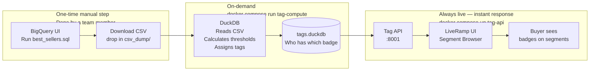
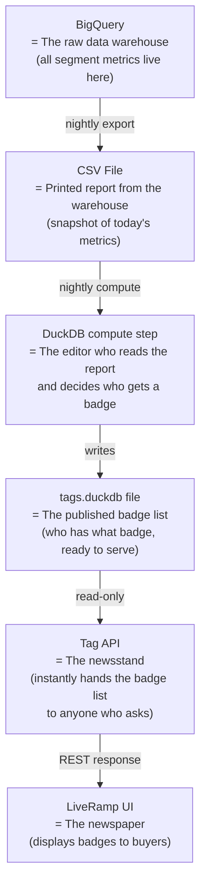
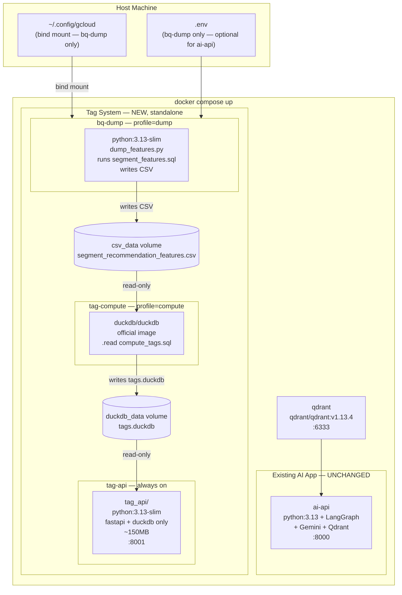

# Segment Tag Labeling System — Hackathon (Local) Plan

---

## What Are We Building? (Plain English)

### The Problem

LiveRamp's marketplace has **hundreds of thousands of syndicated data segments** — each one is a group of people sharing some characteristic (e.g., "New Car Intenders", "Frequent Flyers", "High Income Households"). Buyers who want to target these groups have to scroll through a massive, unlabelled list.

There are **no visual cues** to tell a buyer which segments are widely popular on Facebook, which have huge mobile reach, or which are top sellers. Finding the right segment today requires expertise and time.

### What We're Building

A backend system that **automatically attaches recommendation tags** to segments — similar to how Amazon shows "Best Seller", "#1 in Category", or "Amazon's Choice" badges on products.

Examples of tags a buyer will see:

| Tag | What it means (plain English) |
|---|---|
| `Top Facebook Activated` | This segment is among the most widely used on Facebook |
| `High iOS Reach` | This segment can reach a very large number of iPhone users |
| `High Android Reach` | This segment can reach a very large number of Android users |
| `Massive Cookie Scale` | This segment has an exceptionally large web audience |
| `Cross-Device Champion` | Strong reach on web, iOS, and Android simultaneously |
| `Multi-Platform Powerhouse` | Active on 5 or more ad platforms at once |
| `Buyer Magnet` | Many distinct buyers have activated this segment |
| `Highly Distributed` | Distributed to more destination accounts than 90% of all segments |
| `Top Impressions` | Delivered more ad impressions than 90% of all segments |
| `High Revenue Performer` | Generated more data revenue than 90% of all segments |
| `Bestseller` | Ranks in the top group by blended popularity score |
| `Premium Data` | High distribution AND high revenue — dual top performer |

These tags are **pre-computed nightly**, stored, and served instantly via an API. The UI reads these tags and displays them as badges on the segment browser.

---

## Simple End-to-End Flow



**Manual (one-time)**: Someone with BigQuery access runs `best_sellers.sql`, downloads the CSV, drops it in `csv_dump/`. This file can be shared with the whole team — nobody else needs BigQuery access.

**On-demand**: `docker compose --profile compute run --rm tag-compute` reads the CSV and rebuilds `tags.duckdb`. Runs in ~30 seconds. Re-run whenever the CSV is refreshed.

**Always live**: The `tag-api` container reads `tags.duckdb` and responds to API calls in milliseconds. No BigQuery, no secrets, no AI.

---

## What Does Each Piece Do?

Think of it like a **newspaper publishing pipeline**:



| Component | Real-world analogy | Technical tool |
|---|---|---|
| BigQuery | The data warehouse — all raw numbers live here | Google BigQuery |
| CSV export | A printed snapshot of today's numbers | `bq-dump` Docker service |
| Tag computation | An editor who reads the numbers and stamps badges | `duckdb/duckdb` official Docker image running `compute_tags.sql` |
| Tag store | The published, ready-to-serve badge list | `tags.duckdb` file (DuckDB database) |
| Tag API | The server that hands out badges on demand | FastAPI (Python) — standalone service |
| UI | What the buyer sees | Calls `GET /v1/tags` endpoints |

---

## What Is NOT in This System

This is a **pure backend, no-AI system**. It does not:
- Use any LLM or AI model
- Call Gemini, ChatGPT, or any embedding model
- Make real-time BigQuery calls when a buyer loads the UI
- Require any secrets or API keys to serve tags

The existing AI/RAG system (segment search by natural language) **runs separately and is not changed**.

---

## Problem Scope

`SegmentFeatureRow` (from `csv_dump/segment_recommendation_features.csv`) already carries every metric needed to compute tags:

- **Reach**: `cookie_reach`, `ios_reach`, `android_reach` (from `query_results.csv` / BigQuery dump)
- **Distribution**: `active_destination_accounts`, `active_buyers`, `active_distribution_platforms`, `active_platform_names`
- **Usage/Revenue**: `impressions`, `gross_data_revenue`, `buyers_with_usage`, `platforms_with_usage`
- **Pre-computed ranks**: `distribution_rank`, `impressions_rank`, `provider_revenue_rank`, `popularity_rank`
- **Pre-computed flags**: `is_highly_distributed`, `is_highly_used`, `is_top_n_popular`

**Goal**: batch-compute declarative recommendation tags from these columns, store in a single DuckDB file, and serve via FastAPI — one tool, one file, zero new Docker services.

---

## Why This Works

The `duckdb/duckdb` official image ships the DuckDB CLI. It can execute a `.sql` file directly against a database file on a mounted volume:

```bash
docker run --rm -it \
  -v "$(pwd):/workspace" \
  -w /workspace \
  duckdb/duckdb \
  /workspace/data/tags.duckdb \
  ".read compute_tags.sql"
```

This means **zero custom Python needed for the compute step** — tag rules, percentile thresholds, and index building are all pure SQL CTEs in `compute_tags.sql`. The SQL is the source of truth for tag logic.

The FastAPI Python container reads the resulting `tags.duckdb` file in **read-only mode** — safe for concurrent API requests.

---

## Data Pipeline — What We Have vs What We Need

### The two existing CSV files explained

| File | Rows | Columns | What it contains | Can compute tags? |
|---|---|---|---|---|
| `dms_segments_best_sellers.csv` | 1.1M | **4 only** — id, seller, name, description | Names and descriptions for Qdrant text search | **No** — zero metrics |
| `csv_dump/best_sellers_output.csv` | top segments | 22 — full metrics | Reach, distribution, platform data from `best_sellers.sql` | **Yes** — covers 11 tags |

`dms_segments_best_sellers.csv` is only for Qdrant text search. It has no metrics — you cannot compute any tag from it.

### How the metrics CSV is created — manual download, zero automation

Run `best_sellers.sql` in BigQuery UI (or `bq` CLI), download the result as CSV, and place it at:

```
csv_dump/best_sellers_output.csv
```

That's the only manual step. Everything after that — tag computation, API serving — is fully automated via `docker compose`.

```
BigQuery UI → Run best_sellers.sql → Download as CSV → drop in csv_dump/
```

No Docker service needed. No GCP credentials in Docker. No `.env` required.

### Tags available vs tags dropped

| Tag | Available from `best_sellers.sql`? |
|---|---|
| `TOP_FACEBOOK_ACTIVATED` | Yes — `active_platform_names` + `is_highly_distributed` |
| `TOP_TTD_ACTIVATED` | Yes — exact name in data: `'The Trade Desk'` |
| `TOP_GOOGLE_ACTIVATED` | Yes — exact name in data: `'Google \| Data Marketplace'` (DV360 does not appear) |
| `MULTI_PLATFORM_POWERHOUSE` | Yes — `active_platforms >= 5` |
| `HIGH_IOS_REACH` | Yes — `ios_reach` percentile |
| `HIGH_ANDROID_REACH` | Yes — `android_reach` percentile |
| `MASSIVE_COOKIE_SCALE` | Yes — `cookie_reach` top 1% |
| `CROSS_DEVICE_CHAMPION` | Yes — all three reach metrics above p80 |
| `HIGHLY_DISTRIBUTED` | Yes — `is_highly_distributed` pass-through |
| `BUYER_MAGNET` | Yes — `active_buyers` percentile |
| `BROAD_PLATFORM_BREADTH` | Yes — `active_platforms >= 4` |
| `TOP_IMPRESSIONS` | **No** — `impressions` not in `best_sellers.sql` |
| `HIGH_REVENUE_PERFORMER` | **No** — `gross_data_revenue` not in `best_sellers.sql` |
| `BESTSELLER` | **No** — `popularity_score` not in `best_sellers.sql` |
| `PREMIUM_DATA` | **No** — depends on revenue |

**11 tags for the hackathon.** The 4 revenue/impressions tags can be added post-hackathon when `segment_features.sql` is written.

### Confirmed file format (from actual `query_results.csv` — 321 rows, partial sample of the full BQ export)

The file the user will provide has this exact format:

- **Tab-separated** (`\t` delimiter, not comma) — `compute_tags.sql` must use `read_csv('file.csv', delim='\t')`
- **`active_platform_names`** is a quoted comma-space string inside the TSV: `"MNTN, Simpli.fi, Tubi.tv"` → DuckDB `string_split(active_platform_names, ', ')` converts to a list for `list_contains()` checks
- **`reach_by_platform`** is a very long semicolon-separated string of per-platform reach values — not needed for the 11 tags but available for future platform-specific reach tags
- **`active_platforms`** = count of distinct active platforms (integer) — used for `MULTI_PLATFORM_POWERHOUSE` (>= 5) and `BROAD_PLATFORM_BREADTH` (>= 4). Aliased to `active_distribution_platforms` in `compute_tags.sql` for clarity.
- **Confirmed platform names** (from `query_results.csv`): MNTN, Tubi.tv, Facebook, Xandr, StackAdapt, Amazon, The Trade Desk, TikTok, Pinterest, `"Google | Data Marketplace"`. **"DV360" does not appear** — the tag must match `'Google | Data Marketplace'` exactly.
- **`active_platforms` range**: 3–12+ in the sample; `MULTI_PLATFORM_POWERHOUSE` (>= 5) fires on ~40% of rows in this sample.
- **The 321-row sample** is only the `is_highly_distributed AND is_highly_reachable` intersection. The full BQ export will include segments where only one flag is true, giving a wider distribution for meaningful percentile thresholds.
- **`is_top_n_by_reach`** is `false` for all rows in the sample — it will be `true` for a different subset in the full export.

All 11 tags are computable from this schema. The user will provide the actual final filename — `compute_tags.sql` will reference that filename (or an environment-configurable path).

---

## Full Containerisation — Stack Mapping

The tag system is a **completely standalone service**. Zero code shared with the existing AI app.

| Concern | Hackathon (Docker) | Production (path-to-prod) |
|---|---|---|
| Data source | `csv_dump/` named volume, written by `bq-dump` service | BigQuery materialized views |
| Batch compute | **`duckdb/duckdb` official image** runs `compute_tags.sql` | Dataproc Spark |
| Tag rule definition | SQL CTEs in `compute_tags.sql` | Cloud Spanner `tag_rules` table |
| Tag store + index | `tags.duckdb` on named Docker volume `duckdb_data` | Cloud Bigtable |
| Hot cache | `functools.lru_cache` in-process | Cloud Memorystore Redis |
| Tag API | **`tag_api/` standalone project** — FastAPI + DuckDB only, port 8001, ~150MB image | gRPC TagService + grpc-gateway |
| Existing AI app | **Unchanged** — separate container, separate port (8000) | Unchanged |
| Shared artifacts | `duckdb_data` volume (`tags.duckdb`) and `csv_data` volume (CSV) via Docker volumes only | GCS bucket |
| Orchestration | `docker compose --profile compute run --rm tag-compute` | Cloud Composer Airflow DAG |
| GCP credentials | Only `bq-dump` service needs them | Workload Identity |
| Setup for new team member | `docker compose up -d` → zero secrets, tags live on :8001 | Helm chart deploy |

---

## Tag Taxonomy (15 tags, all computable from existing CSV columns)

### Platform Activation
- `TOP_FACEBOOK_ACTIVATED` — `"Facebook"` in `active_platform_names` AND `is_highly_distributed`
- `TOP_TTD_ACTIVATED` — `"The Trade Desk"` in `active_platform_names` AND `is_highly_distributed`
- `TOP_GOOGLE_ACTIVATED` — `"Google | Data Marketplace"` in `active_platform_names` AND `is_highly_distributed` (renamed from TOP_DV360_ACTIVATED — "DV360" does not appear in the actual data; the exact platform name is "Google | Data Marketplace")
- `MULTI_PLATFORM_POWERHOUSE` — `active_platforms >= 5`

### Reach
- `HIGH_IOS_REACH` — `ios_reach` in top 10% of non-zero values
- `HIGH_ANDROID_REACH` — `android_reach` in top 10% of non-zero values
- `MASSIVE_COOKIE_SCALE` — `cookie_reach` in top 1%
- `CROSS_DEVICE_CHAMPION` — top decile on all three reach types simultaneously

### Distribution
- `HIGHLY_DISTRIBUTED` — pass-through of `is_highly_distributed = true`
- `BUYER_MAGNET` — `active_buyers` in top 10%
- `BROAD_PLATFORM_BREADTH` — `active_distribution_platforms >= 4`

### Impressions & Revenue
- `TOP_IMPRESSIONS` — pass-through of `is_highly_used = true`
- `HIGH_REVENUE_PERFORMER` — `gross_data_revenue` in top 10%

### Composite
- `BESTSELLER` — `is_top_n_popular = true`
- `PREMIUM_DATA` — top 20% on distribution AND reach AND revenue simultaneously

---

## Full Docker Architecture



**Zero code shared between the AI app and the tag system.** They communicate only through Docker named volumes (`csv_data`, `duckdb_data`) — not imports, not HTTP calls, not shared Python packages.

---

## Component Design

### 0. `docker-compose.yml` — Full Containerised Stack

```yaml
services:

  qdrant:                                    # unchanged
    image: qdrant/qdrant:v1.13.4
    ports: ["6333:6333", "6334:6334"]
    volumes:
      - qdrant_storage:/qdrant/storage
    restart: unless-stopped

  tag-compute:                               # official DuckDB CLI image — no custom build
    image: duckdb/duckdb
    volumes:
      - ./csv_dump:/workspace/csv_dump:ro    # bind-mount — user drops best_sellers_output.csv here
      - ./compute_tags.sql:/workspace/compute_tags.sql:ro
      - duckdb_data:/workspace/data          # shared volume — writes tags.duckdb here
    working_dir: /workspace
    command: ["/workspace/data/tags.duckdb", ".read /workspace/compute_tags.sql"]
    profiles: ["compute"]

  tag-api:
    build: ./tag_api                         # standalone lightweight image
    ports: ["8001:8001"]
    volumes:
      - duckdb_data:/app/duckdb_data:ro
    environment:
      TAGS_DUCKDB_PATH: /app/duckdb_data/tags.duckdb
    restart: unless-stopped

volumes:
  qdrant_storage:
  duckdb_data:
# NOTE: csv_dump/ is a plain host directory (bind-mount above), not a named volume.
# Team members drop best_sellers_output.csv there manually. No Docker volume to manage.
```

### Credentials boundary — zero secrets for the tag system

| Service | `.env` | GCP creds | Why |
|---|---|---|---|
| `qdrant` | No | No | Static image |
| `tag-compute` | **No** | **No** | Pure DuckDB SQL, reads local CSV |
| `tag-api` | **No** | **No** | Reads `tags.duckdb` only |
| `ai-api` (existing, unchanged) | Yes | Optional | Calls Gemini + BigQuery |

**No `bq-dump` service.** The CSV download from BigQuery is a one-time manual step done in the BigQuery UI — drag-and-drop the file into `csv_dump/`.

**`tag_api/Dockerfile`** (new — standalone, no `lr_bestsellers` deps):

```dockerfile
FROM python:3.13-slim

RUN pip install uv --no-cache-dir

WORKDIR /app
COPY pyproject.toml uv.lock* ./
RUN uv sync --frozen --no-dev
# installs only: fastapi, uvicorn, duckdb, pydantic, structlog
# NO: langchain, langgraph, google-cloud-*, qdrant-client

COPY . .

CMD ["uv", "run", "uvicorn", "main:app", \
     "--host", "0.0.0.0", "--port", "8001"]
```

**`tag_api/pyproject.toml`** — minimal deps:

```toml
[project]
name = "lr-tag-api"
version = "0.1.0"
requires-python = ">=3.13"
dependencies = [
    "fastapi>=0.111",
    "uvicorn[standard]>=0.29",
    "duckdb>=1.0",
    "pydantic>=2.7",
    "structlog>=24.0",
]
```

**`docker-compose.yml`** additions (existing `qdrant` + `ai-api` services unchanged):

```yaml
  tag-api:
    build: ./tag_api              # standalone Dockerfile, ~150MB image
    ports: ["8001:8001"]
    volumes:
      - duckdb_data:/app/duckdb_data:ro   # reads tags.duckdb
    environment:
      TAGS_DUCKDB_PATH: /app/duckdb_data/tags.duckdb
    restart: unless-stopped        # no secrets, safe to always-on

  tag-compute:
    image: duckdb/duckdb           # official image — no custom build
    volumes:
      - csv_data:/workspace/csv_dump:ro
      - ./compute_tags.sql:/workspace/compute_tags.sql:ro
      - duckdb_data:/workspace/data
    working_dir: /workspace
    command: ["/workspace/data/tags.duckdb", ".read /workspace/compute_tags.sql"]
    profiles: ["compute"]

  bq-dump:
    build: .                       # existing ai-app image (has google-cloud-bigquery)
    volumes:
      - csv_data:/app/csv_dump
      - ${GOOGLE_APPLICATION_CREDENTIALS_PATH:-~/.config/gcloud}:/gcp:ro
    environment:
      GOOGLE_APPLICATION_CREDENTIALS: /gcp/application_default_credentials.json
    env_file:
      - path: .env
        required: true
    command: ["uv", "run", "python", "-m", "lr_bestsellers.ingestion.dump_features"]
    profiles: ["dump"]

volumes:
  qdrant_storage:    # existing
  duckdb_data:       # new — tags.duckdb
  csv_data:          # new — segment_recommendation_features.csv
```

### 1. `compute_tags.sql` — All-SQL Tag Computation

This is the single source of truth for all tag rules. No Python, no YAML — pure DuckDB SQL. The `duckdb/duckdb` CLI executes it with `.read compute_tags.sql`.

```sql
-- Step 1: Load the tab-separated BigQuery export
-- File is TSV (tab-separated), active_platform_names is comma-space delimited inside the field
CREATE OR REPLACE VIEW raw AS
SELECT * FROM read_csv(
  '/workspace/csv_dump/best_sellers_output.csv',
  delim='\t',
  header=true,
  quote='"'
);

-- Step 2: Compute percentile thresholds (single pass)
CREATE OR REPLACE TABLE thresholds AS
SELECT
  PERCENTILE_CONT(0.90) WITHIN GROUP (ORDER BY ios_reach)
    FILTER (WHERE ios_reach > 0)           AS ios_reach_p90,
  PERCENTILE_CONT(0.90) WITHIN GROUP (ORDER BY android_reach)
    FILTER (WHERE android_reach > 0)       AS android_reach_p90,
  PERCENTILE_CONT(0.99) WITHIN GROUP (ORDER BY cookie_reach)
    FILTER (WHERE cookie_reach > 0)        AS cookie_reach_p99,
  PERCENTILE_CONT(0.90) WITHIN GROUP (ORDER BY active_buyers)  AS buyers_p90,
  PERCENTILE_CONT(0.90) WITHIN GROUP (ORDER BY gross_data_revenue) AS revenue_p90,
  PERCENTILE_CONT(0.80) WITHIN GROUP (ORDER BY ios_reach)
    FILTER (WHERE ios_reach > 0)           AS ios_p80,   -- for CROSS_DEVICE_CHAMPION
  PERCENTILE_CONT(0.80) WITHIN GROUP (ORDER BY android_reach)
    FILTER (WHERE android_reach > 0)       AS android_p80,
  PERCENTILE_CONT(0.80) WITHIN GROUP (ORDER BY cookie_reach)
    FILTER (WHERE cookie_reach > 0)        AS cookie_p80,
  PERCENTILE_CONT(0.80) WITHIN GROUP (ORDER BY gross_data_revenue) AS revenue_p80
FROM raw;

-- Step 3: Evaluate all tag rules per segment
CREATE OR REPLACE TABLE tagged AS
SELECT
  r.dms_segment_id AS segment_id,
  -- Platform Activation
  -- active_platform_names is "Platform A, Platform B" — split on ', ' for list_contains
  (list_contains(string_split(r.active_platform_names, ', '), 'Facebook')
    AND r.is_highly_distributed)                          AS top_facebook_activated,
  (list_contains(string_split(r.active_platform_names, ', '), 'The Trade Desk')
    AND r.is_highly_distributed)                          AS top_ttd_activated,
  (list_contains(string_split(r.active_platform_names, ', '), 'Google | Data Marketplace')
    AND r.is_highly_distributed)                          AS top_google_activated,
  -- NOTE: Platform name in BigQuery output is 'Google | Data Marketplace', not 'DV360'
  (r.active_platforms >= 5)                               AS multi_platform_powerhouse,
  -- Reach
  (r.ios_reach     >= t.ios_reach_p90)                    AS high_ios_reach,
  (r.android_reach >= t.android_reach_p90)                AS high_android_reach,
  (r.cookie_reach  >= t.cookie_reach_p99)                 AS massive_cookie_scale,
  (r.ios_reach     >= t.ios_p80
    AND r.android_reach >= t.android_p80
    AND r.cookie_reach  >= t.cookie_p80)                  AS cross_device_champion,
  -- Distribution
  r.is_highly_distributed                                  AS highly_distributed,
  (r.active_buyers >= t.buyers_p90)                       AS buyer_magnet,
  (r.active_platforms >= 4)                               AS broad_platform_breadth,
  -- Usage / Revenue
  r.is_highly_used                                         AS top_impressions,
  (r.gross_data_revenue >= t.revenue_p90)                 AS high_revenue_performer,
  -- Composite
  r.is_top_n_popular                                       AS bestseller,
  (r.is_highly_distributed
    AND r.gross_data_revenue >= t.revenue_p80)            AS premium_data
FROM raw r CROSS JOIN thresholds t;

-- Step 4: Write tag_definitions
CREATE OR REPLACE TABLE tag_definitions AS
SELECT * FROM (VALUES
  ('top_facebook_activated',  'Top Facebook Activated',    'Top 10% distributed on Facebook',       'platform_activation', '🟦', '#1877F2', 1),
  ('top_ttd_activated',       'Top TTD Activated',         'Top 10% distributed on The Trade Desk', 'platform_activation', '🟩', '#00C389', 2),
  ('top_google_activated',    'Top Google Activated',      'Top 10% distributed on Google | Data Marketplace', 'platform_activation', '🟨', '#FBBC04', 3),
  ('multi_platform_powerhouse','Multi-Platform Powerhouse','Active on 5+ platforms',                'platform_activation', '🌐', '#7B61FF', 4),
  ('high_ios_reach',          'High iOS Reach',            'Top 10% by iOS device reach',           'reach',               '📱', '#555555', 5),
  ('high_android_reach',      'High Android Reach',        'Top 10% by Android device reach',       'reach',               '🤖', '#3DDC84', 6),
  ('massive_cookie_scale',    'Massive Cookie Scale',      'Top 1% by cookie reach',                'reach',               '🍪', '#FF6B35', 7),
  ('cross_device_champion',   'Cross-Device Champion',     'Top 20% on all three reach types',      'reach',               '🏆', '#FFD700', 8),
  ('highly_distributed',      'Highly Distributed',        'Top 10% by destination accounts',       'distribution',        '📡', '#0099CC', 9),
  ('buyer_magnet',            'Buyer Magnet',              'Top 10% by active buyers',              'distribution',        '🧲', '#FF4081', 10),
  ('broad_platform_breadth',  'Broad Platform Breadth',    'Active on 4+ platforms',                'distribution',        '🗺️', '#8BC34A', 11),
  ('top_impressions',         'Top Impressions',           'Top 10% by impressions delivered',      'impressions',         '📊', '#9C27B0', 12),
  ('high_revenue_performer',  'High Revenue Performer',    'Top 10% by gross data revenue',         'revenue',             '💰', '#4CAF50', 13),
  ('bestseller',              'Bestseller',                'Top-N by blended popularity score',     'composite',           '⭐', '#FF9800', 14),
  ('premium_data',            'Premium Data',              'Highly distributed + high revenue',     'composite',           '💎', '#00BCD4', 15)
) t(tag_key, display_name, description, category, icon, color_hex, priority);

-- Step 5: Unpivot tagged rows → segment_tag_assignments
CREATE OR REPLACE TABLE segment_tag_assignments AS
SELECT segment_id, tag_key, 1.0 AS score, current_timestamp::VARCHAR AS computed_at
FROM tagged
UNPIVOT (is_tagged FOR tag_key IN (
  top_facebook_activated, top_ttd_activated, top_google_activated, multi_platform_powerhouse,
  high_ios_reach, high_android_reach, massive_cookie_scale, cross_device_champion,
  highly_distributed, buyer_magnet, broad_platform_breadth,
  top_impressions, high_revenue_performer, bestseller, premium_data
))
WHERE is_tagged = true;

-- Step 6: Build inverted index
CREATE OR REPLACE TABLE tag_segment_index AS
SELECT tag_key, segment_id, score FROM segment_tag_assignments;

CREATE INDEX IF NOT EXISTS idx_sta_seg ON segment_tag_assignments(segment_id);
CREATE INDEX IF NOT EXISTS idx_tsi_tag ON tag_segment_index(tag_key, score DESC);
```

This is ~80 lines of SQL. Adding a new tag = one new column in the `tagged` CTE + one row in `tag_definitions` VALUES + one entry in the UNPIVOT list. No Python deploy.

### 2. `lr_bestsellers/tags/evaluator.py` — Pure Rule Engine

No I/O. Takes a `dict[str, float | str | list[str]]` of metric values and a `list[TagRule]` and returns `bool`. Supports:
- `percentile_threshold` — value >= precomputed threshold float
- `top_n` — rank column <= N
- `platform_contains` — platform name substring in `active_platform_names` list
- `boolean_flag` — pass-through of a bool column (`is_highly_distributed`, etc.)
- `composite` — all sub-rules in same `conjunction_group` must pass (AND)

Thresholds are precomputed by DuckDB and passed in at call time — the evaluator has no DB access.

### 3. `lr_bestsellers/tags/compute.py` — DuckDB Batch Computation

Run with `uv run python -m lr_bestsellers.tags.compute`.

Steps:
1. Load CSV into DuckDB in-memory relation
2. Compute percentile thresholds for each metric in one SQL pass:

```sql
SELECT
  PERCENTILE_CONT(0.90) WITHIN GROUP (ORDER BY ios_reach)    FILTER (WHERE ios_reach > 0) AS ios_reach_p90,
  PERCENTILE_CONT(0.90) WITHIN GROUP (ORDER BY android_reach) FILTER (WHERE android_reach > 0) AS android_reach_p90,
  PERCENTILE_CONT(0.99) WITHIN GROUP (ORDER BY cookie_reach)  FILTER (WHERE cookie_reach > 0) AS cookie_reach_p99,
  PERCENTILE_CONT(0.90) WITHIN GROUP (ORDER BY active_buyers) AS buyers_p90,
  PERCENTILE_CONT(0.90) WITHIN GROUP (ORDER BY gross_data_revenue) AS revenue_p90,
  PERCENTILE_CONT(0.80) WITHIN GROUP (ORDER BY ios_reach)    FILTER (WHERE ios_reach > 0) AS ios_reach_p80,
  PERCENTILE_CONT(0.80) WITHIN GROUP (ORDER BY android_reach) FILTER (WHERE android_reach > 0) AS android_reach_p80,
  PERCENTILE_CONT(0.80) WITHIN GROUP (ORDER BY cookie_reach)  FILTER (WHERE cookie_reach > 0) AS cookie_reach_p80,
  PERCENTILE_CONT(0.80) WITHIN GROUP (ORDER BY gross_data_revenue) AS revenue_p80
FROM read_csv_auto('csv_dump/segment_recommendation_features.csv')
```

3. Iterate rows (or use DuckDB SQL predicates directly for speed), call `evaluator.evaluate(row, rules, thresholds)` per tag
4. Write `(segment_id, tag_key, score, computed_at)` rows to `tags.db` via `sqlite3`
5. Rebuild inverted index table

Runtime estimate: < 30 seconds for 1M segments on a laptop (DuckDB is columnar, single-pass).

### 4. `lr_bestsellers/tags/duckdb_store.py` — DuckDB Tag Store

Implements `TagStoreProtocol`. Opens `tags.duckdb` in **read-only mode** on construction — safe for concurrent FastAPI requests.

```python
conn = duckdb.connect("tags.duckdb", read_only=True)
```

Three query patterns:

- `get_tags_for_segment(segment_id)` → indexed point lookup on `segment_tag_assignments`
- `get_segments_by_tag(tag_key, limit, offset)` → range scan on `tag_segment_index(tag_key, score DESC)`
- `list_tag_definitions()` → full scan of `tag_definitions` (~15 rows, sub-millisecond)

DuckDB schema (written by `compute.py`):

```sql
CREATE TABLE tag_definitions (
  tag_key      VARCHAR PRIMARY KEY,
  display_name VARCHAR NOT NULL,
  description  VARCHAR,
  category     VARCHAR NOT NULL,
  icon         VARCHAR,
  color_hex    VARCHAR,
  priority     INTEGER DEFAULT 0,
  is_active    BOOLEAN DEFAULT true
);

CREATE TABLE segment_tag_assignments (
  segment_id  BIGINT  NOT NULL,
  tag_key     VARCHAR NOT NULL,
  score       DOUBLE  DEFAULT 1.0,
  computed_at VARCHAR NOT NULL,
  PRIMARY KEY (segment_id, tag_key)
);
CREATE INDEX idx_sta_seg ON segment_tag_assignments(segment_id);

CREATE TABLE tag_segment_index (
  tag_key    VARCHAR NOT NULL,
  segment_id BIGINT  NOT NULL,
  score      DOUBLE  DEFAULT 1.0,
  PRIMARY KEY (tag_key, segment_id)
);
CREATE INDEX idx_tsi_tag ON tag_segment_index(tag_key, score DESC);
```

DuckDB enforces these indexes during read-only queries — point lookups and range scans are O(log N), same as SQLite B-tree indexes.

### 5. `lr_bestsellers/tags/api/routes.py` — Three FastAPI Endpoints

Added to the existing `/v1` router in [`lr_bestsellers/api/routes.py`](lr_bestsellers/api/routes.py):

```
GET /v1/tags
  → list[TagDefinition]  (all active tag definitions + metadata)

GET /v1/segments/{segment_id}/tags
  → list[SegmentTag]     (tags assigned to one segment)

GET /v1/tags/{tag_key}/segments?page=1&page_size=50
  → CatalogPage          (segments carrying this tag, paginated, reusing existing CatalogPage model)
```

Dependencies injected via `Depends` from `lr_bestsellers/tags/api/dependencies.py` — same pattern as existing `api/dependencies.py`.

---

## Files Changed / Added

```
# New standalone tag system — completely separate from lr_bestsellers/
tag_api/
  pyproject.toml                    # fastapi + duckdb + pydantic + structlog ONLY
  uv.lock
  Dockerfile                        # python:3.13-slim ~150MB — no AI deps
  main.py                           # FastAPI app factory + lifespan
  models.py                         # TagDefinition, SegmentTag, TagCategory
  store.py                          # TagStoreProtocol + DuckDbTagStore + EmptyTagStore
  routes.py                         # GET /v1/tags, /v1/segments/{id}/tags, /v1/tags/{key}/segments
  dependencies.py                   # get_tag_store() provider
  exceptions.py                     # TagStoreError
  tests/
    __init__.py
    conftest.py                     # in-memory DuckDB fixture
    test_store.py                   # DuckDbTagStore + EmptyTagStore
    test_routes.py                  # TestClient, dependency_overrides
    test_models.py                  # Pydantic validation

# New shared file (in existing repo root)
compute_tags.sql                    # DuckDB CLI tag computation — reads csv_dump/best_sellers_output.csv

# Modified (existing repo)
docker-compose.yml                  # +tag-api :8001 +tag-compute +duckdb_data volume
csv_dump/                           # existing gitignored dir — team drops best_sellers_output.csv here
.gitignore                          # +tag_api/.venv
```

**Existing `lr_bestsellers/` is not modified** except for adding `dump_features.py` to the ingestion package.
`lr_bestsellers/config.py`, `lr_bestsellers/api/app.py`, `lr_bestsellers/api/routes.py` — **untouched**.

`tags.duckdb` lives in a Docker named volume (`duckdb_data`) — never on the host filesystem, never in git.

---

## Setup for Any Team Member

Three steps. Zero local installs. Zero secrets for the tag system.

```
Step 1 — One-time manual (you do this once, share the file with the team)
  Download the BigQuery export (TSV format, same schema as query_results.csv)
  → drop in csv_dump/   (filename confirmed by user — plan uses best_sellers_output.csv as placeholder)

Step 2 — Compute tags (run after any CSV refresh)
  docker compose --profile compute run --rm tag-compute

Step 3 — Start the tag API (runs forever)
  docker compose up -d tag-api
```

```bash
# Full command sequence for a new team member:

# 1. Clone
git clone <repo>

# 2. Drop the CSV (get this file from whoever ran the BigQuery export)
#    csv_dump/best_sellers_output.csv  ← place it here

# 3. Compute tags (~30 seconds)
docker compose --profile compute run --rm tag-compute

# 4. Start tag API
docker compose up -d tag-api

# 5. Done — tag endpoints are live on :8001
curl http://localhost:8001/v1/tags
curl http://localhost:8001/v1/segments/12345/tags
curl "http://localhost:8001/v1/tags/high_ios_reach/segments?page=1&page_size=10"
```

The `compute` profile ensures `docker compose up` never accidentally re-runs the tag computation.

---

---

## Engineering Standards & Quality Gates

Every item below is either mandated by `AGENTS.md` or added here for the tags module specifically. All must pass before the implementation is considered complete.

---

### SOLID Principles

**Single Responsibility**
- `compute_tags.sql` — computes and writes tags. Nothing else.
- `DuckDbTagStore` — reads tags from DuckDB. No HTTP, no business logic.
- `routes.py` — HTTP boundary only. Delegates everything to `DuckDbTagStore` via protocol.
- `models.py` — data shapes only. No I/O.

**Open / Closed**
- Adding a new tag = edit `compute_tags.sql` only (new CTE column + VALUES row + UNPIVOT entry). Zero Python changes, zero Docker rebuild of the API image.
- `DuckDbTagStore` is closed to modification; new backends implement `TagStoreProtocol`.

**Liskov Substitution**
- Any class implementing `TagStoreProtocol` (`DuckDbTagStore`, future `BigtableTagStore`, test doubles) must be substitutable without changing callers. Protocol methods must never strengthen preconditions or weaken postconditions.

**Interface Segregation**
- `TagStoreProtocol` exposes exactly three methods — no fat interface:

```python
class TagStoreProtocol(Protocol):
    def get_tags_for_segment(self, segment_id: int) -> list[SegmentTag]: ...
    def get_segments_by_tag(self, tag_key: str, limit: int, offset: int) -> list[int]: ...
    def list_tag_definitions(self) -> list[TagDefinition]: ...
```

**Dependency Inversion**
- FastAPI routes depend on `TagStoreProtocol` (abstraction), injected via `Depends(get_tag_store)`.
- `get_tag_store()` is the only place that knows `DuckDbTagStore` exists — swap it for production without touching routes.

---

### Design Patterns

**Repository Pattern** — `DuckDbTagStore` is a repository: all data-access SQL lives inside it, callers never write SQL.

**Dependency Injection** — FastAPI `Depends` throughout. No `get_settings()` or `DuckDbTagStore()` called inside route handlers.

**Provider / Factory with Singleton** — `get_tag_store()` in `dependencies.py` decorated with `@lru_cache(maxsize=1)`. Returns the same `DuckDbTagStore` instance for the process lifetime.

```python
@lru_cache(maxsize=1)
def get_tag_store(settings: Annotated[Settings, Depends(get_api_settings)]) -> TagStoreProtocol:
    return DuckDbTagStore(path=settings.tags_duckdb_path)
```

**Null Object Pattern** — `EmptyTagStore` implements `TagStoreProtocol` returning empty lists. Used when `tags.duckdb` does not exist, so the API starts cleanly with zero tags rather than crashing.

**Lifespan Resource Management** — DuckDB connection opened once in FastAPI `lifespan`, stored in `app.state.tag_db`, closed on shutdown. Never opened per request.

```python
@asynccontextmanager
async def lifespan(app: FastAPI) -> AsyncIterator[None]:
    app.state.tag_db = duckdb.connect(str(settings.tags_duckdb_path), read_only=True)
    try:
        yield
    finally:
        app.state.tag_db.close()
```

---

### Memory Leak Prevention

DuckDB connections are the primary leak risk. Rules:

- **One connection per process** — `@lru_cache` singleton, opened in `lifespan`, closed on shutdown.
- **Never open per request** — opening a DuckDB connection for every API call leaks file descriptors on the container.
- **read_only=True enforced** — prevents accidental writes from the API process. DuckDB will raise an error if the API tries to write.
- **Bounded caches only** — `@lru_cache(maxsize=1)` for the store provider, `@lru_cache(maxsize=1)` for `list_tag_definitions()` (tag definitions never change during a process lifetime). No unbounded `dict` caches.
- **No mutable default arguments** — Pydantic `default_factory=list` everywhere, never `field(default=[])`.
- **pathlib.Path, not str** — no dangling string handles to file paths that may be garbage-collected while in use.
- **`contextlib.closing`** — wrap any cursor or connection used in a helper function so it closes even on exception.

---

### Pythonic Coding Standards

All of these are in addition to existing `AGENTS.md` invariants (`from __future__ import annotations`, full type annotations, `mypy --strict`, `structlog`, Google docstrings, Pydantic v2).

**Type aliases** — define once in `models.py`, import everywhere:
```python
TagKey = str       # e.g. "high_ios_reach"
SegmentId = int    # dms_segment_id
```

**`pathlib.Path` for all file paths** — never `os.path.join`, never `str` for paths passed between functions.

**`__all__`** in every `__init__.py` — controls what `from lr_bestsellers.tags import *` exposes and makes the public API explicit.

**Structlog in every module**:
```python
import structlog
log = structlog.get_logger(__name__)
log.info("tag_store.query", segment_id=segment_id, tag_count=len(result))
```

**f-strings** — no `.format()` or `%` formatting.

**Generator expressions** — use `(x for x in ...)` over `[x for x in ...]` where the result is iterated once.

**`Final` for SQL query constants** — store DuckDB query strings as module-level `Final[str]` constants, not inline strings in methods.

**`ruff check` + `ruff format`** — must pass with zero errors before every commit (existing CI gate).

**`mypy --strict`** — must pass on all new modules. `duckdb` stubs are incomplete; use `# type: ignore[import-untyped]` at the import line with a comment explaining why.

---

### Unit Test Coverage

Target: **≥ 90% line coverage** on all new Python files in `lr_bestsellers/tags/`.

Test file structure mirrors the existing pattern (see `test_csv_catalog.py`, `test_api.py`):

**`tag_api/tests/conftest.py`** — shared fixtures (standalone, no `lr_bestsellers` imports):
```python
@pytest.fixture
def in_memory_tag_db() -> duckdb.DuckDBPyConnection:
    """Return a fresh in-memory DuckDB pre-populated with minimal tag data."""
    conn = duckdb.connect(":memory:")
    conn.execute("""
        CREATE TABLE tag_definitions (tag_key VARCHAR, display_name VARCHAR,
          description VARCHAR, category VARCHAR, icon VARCHAR,
          color_hex VARCHAR, priority INTEGER, is_active BOOLEAN);
        CREATE TABLE segment_tag_assignments (segment_id BIGINT, tag_key VARCHAR,
          score DOUBLE, computed_at VARCHAR);
        CREATE TABLE tag_segment_index (tag_key VARCHAR, segment_id BIGINT, score DOUBLE);
    """)
    # seed two tags + two segments
    conn.execute("INSERT INTO tag_definitions VALUES ('high_ios_reach','High iOS Reach','...','reach','📱','#555',1,true)")
    conn.execute("INSERT INTO segment_tag_assignments VALUES (1001,'high_ios_reach',1.0,'2026-08-26')")
    conn.execute("INSERT INTO tag_segment_index VALUES ('high_ios_reach',1001,1.0)")
    return conn
```

**`tag_api/tests/test_store.py`** — covers:
- `get_tags_for_segment` — hit (returns tags), miss (returns `[]`)
- `get_segments_by_tag` — happy path, pagination (limit/offset), unknown tag key returns `[]`
- `list_tag_definitions` — returns all rows, ordered by priority
- Missing-file graceful degradation — `DuckDbTagStore` with nonexistent path returns `EmptyTagStore` behaviour

**`tag_api/tests/test_routes.py`** — covers:
- `GET /v1/tags` 200 + schema check
- `GET /v1/segments/{id}/tags` 200 (tags found), 200 with empty list (segment exists, no tags)
- `GET /v1/tags/{key}/segments` 200 + pagination, 404 (unknown tag key)
- `GET /v1/tags/{key}/segments` 503 when store raises `TagStoreError`
- Uses `app.dependency_overrides[get_tag_store]` with a `Mock` — no real DuckDB in API tests

**`tag_api/tests/test_models.py`** — covers:
- `TagDefinition` valid construction
- `SegmentTag` rejects negative `score`
- `TagCategory` literal values

**`tests/unit/test_compute_sql.py`** — covers:
- Load `compute_tags.sql` into `duckdb.connect(":memory:")` with a 5-row fixture CSV
- Assert `high_ios_reach` is assigned only to segments where `ios_reach` is in the top 10%
- Assert `top_facebook_activated` requires both Facebook in `active_platform_names` AND `is_highly_distributed`
- Assert `cross_device_champion` requires all three reach metrics above p80
- Assert `tag_segment_index` row count == `segment_tag_assignments` row count
- Assert `tag_definitions` has exactly 15 rows

---

### Documentation Updates

**`README.md`** — new sections to add:
- **Quick Start (Docker)** — `cp .env.example .env && docker compose up -d && docker compose --profile compute run --rm tag-compute`
- **Recommendation Tags** — table of all 15 tags with category, trigger condition, API key
- **New API Endpoints** — `GET /v1/tags`, `GET /v1/segments/{id}/tags`, `GET /v1/tags/{key}/segments`
- **Architecture Diagram** — updated to show Docker services
- **Development Commands** — add `docker compose build`, `docker compose logs -f api`

**`AGENTS.md`** — section 3 codebase map additions:
```
│ ├── tags/
│ │   ├── models.py        # TagDefinition, SegmentTag, TagCategory
│ │   ├── protocols.py     # TagStoreProtocol
│ │   ├── duckdb_store.py  # DuckDbTagStore + EmptyTagStore (Null Object)
│ │   └── api/
│ │       ├── routes.py    # GET /v1/tags/*
│ │       └── dependencies.py  # get_tag_store() provider
├── Dockerfile              # python:3.13-slim + uv + duckdb (API image)
├── compute_tags.sql        # DuckDB CLI tag computation (run by duckdb/duckdb image)
```

Also update exception hierarchy in section 6:
```
BestSellersError
└── TagStoreError    # new — Bigtable/DuckDB read failures → HTTP 503
```

---

### Pre-Merge Checklist

```bash
uv run ruff check lr_bestsellers/tags tests/unit/test_tag_*.py tests/unit/test_compute_sql.py
uv run ruff format --check lr_bestsellers/tags
uv run mypy lr_bestsellers/tags
uv run pytest tests/unit/test_tag_*.py tests/unit/test_compute_sql.py -v --tb=short
docker compose build api                            # image builds cleanly
docker compose --profile compute run --rm tag-compute  # SQL runs without error
```

---

## Path to Production (Post-Hackathon)

The code structure is already designed for swap-out:

- Replace `SqliteTagStore` with `BigtableTagStore` (same `TagStoreProtocol`)
- Replace `YamlTagRegistry` with `SpannerTagRegistry` (same `TagRegistryProtocol`)
- Replace `compute.py` script with a Dataproc Spark job calling the same `evaluator.py` logic
- Wrap the FastAPI routes in a gRPC service using the proto defined below
- Add Pub/Sub event emission in the Spark job for cache invalidation

The `evaluator.py` module is pure Python with no I/O — it runs identically on a laptop and on a 2000-worker Dataproc cluster.
