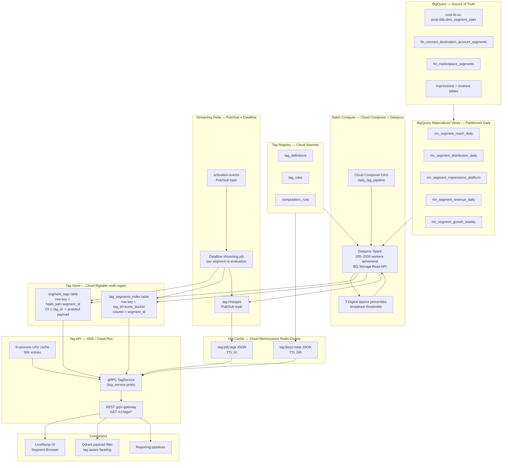

# Segment Tag Labeling System — Production Architecture

## Scale Targets

- Segments: up to 1 trillion
- Raw metric data: petabytes in BigQuery
- Tag store reads: 10M QPS
- API p99 latency: < 20ms
- Tag freshness: daily batch + < 60s delta for activation events
- Tag types: ~30 initially, extensible without code deploys

---

## Tag Taxonomy

All tags are derived from columns already present in the BigQuery source tables (`dms_segment_stats`, `fin_connect_destination_account_segments`, `fin_marketplace_segments`, and the impressions/revenue tables surfaced in `SegmentFeatureRow`).

### Platform Activation
- `TOP_FACEBOOK_ACTIVATED` — top 10% by active destination accounts on Facebook
- `TOP_TTD_ACTIVATED` — top 10% on The Trade Desk
- `TOP_DV360_ACTIVATED` — top 10% on DV360
- `TOP_SNAPCHAT_ACTIVATED` — top 10% on Snapchat
- `MULTI_PLATFORM_POWERHOUSE` — `active_distribution_platforms >= 5`

### Reach
- `HIGH_IOS_REACH` — top 10% of non-zero `ios_reach` (ad_network_id=6778)
- `HIGH_ANDROID_REACH` — top 10% of non-zero `android_reach` (ad_network_id=21906)
- `MASSIVE_COOKIE_SCALE` — top 1% by `cookie_reach`
- `CROSS_DEVICE_CHAMPION` — top decile on all three reach types simultaneously

### Distribution
- `HIGHLY_DISTRIBUTED` — top 10% by `active_destination_accounts`
- `BUYER_MAGNET` — top 10% by `active_buyers`
- `BROAD_PLATFORM_BREADTH` — `active_distribution_platforms >= 4`

### Impressions & Revenue
- `TOP_IMPRESSIONS` — top 10% by total impressions
- `TOP_FACEBOOK_IMPRESSIONS` — top 10% impressions on Facebook specifically
- `HIGH_REVENUE_PERFORMER` — top 10% by `gross_data_revenue`
- `TRENDING_UP` — impressions grew > 50% week-over-week

### Composite
- `BESTSELLER` — top 10% on both `distribution_rank` and `reach_rank`
- `PREMIUM_DATA` — top 20% across reach + distribution + revenue simultaneously
- `RISING_STAR` — segment age < 90 days AND impressions growth in top 25%

---

## Full Architecture



---

## Component Design

### 1. Tag Registry — Cloud Spanner

Single-region Spanner instance. ACID guarantees ensure rule changes are atomic and globally visible. No code deploy required to add or modify a tag — operators update rows in Spanner.

**`tag_definitions`**

```sql
CREATE TABLE tag_definitions (
  tag_id       STRING(36)  NOT NULL,   -- UUID
  tag_key      STRING(64)  NOT NULL,   -- e.g. "high_ios_reach"
  display_name STRING(128) NOT NULL,
  description  STRING(512),
  category     STRING(32)  NOT NULL,   -- reach | distribution | impressions | revenue | composite | platform_activation
  icon         STRING(16),
  color_hex    STRING(7),
  priority     INT64       DEFAULT 0,  -- UI display order
  is_active    BOOL        DEFAULT true,
  created_at   TIMESTAMP   NOT NULL,
  updated_at   TIMESTAMP   NOT NULL,
) PRIMARY KEY (tag_id);

CREATE UNIQUE INDEX uix_tag_key ON tag_definitions(tag_key);
```

**`tag_rules`**

```sql
CREATE TABLE tag_rules (
  rule_id               STRING(36)  NOT NULL,
  tag_id                STRING(36)  NOT NULL,
  metric_name           STRING(64)  NOT NULL,  -- column name in mv_* view
  rule_type             STRING(32)  NOT NULL,
    -- percentile_threshold | absolute_threshold | top_n
    -- platform_contains | boolean_flag | growth_rate | composite
  threshold_percentile  FLOAT64,   -- e.g. 0.90 for top 10%
  threshold_absolute    INT64,
  top_n                 INT64,
  platform_filter       STRING(128),
  computation_window_days INT64    DEFAULT 30,
  conjunction_group     INT64      DEFAULT 1,
    -- rules in same group are AND'd; different groups are OR'd
) PRIMARY KEY (rule_id),
  INTERLEAVE IN PARENT tag_definitions ON DELETE CASCADE;
```

**`computation_runs`** — audit log of every Spark job outcome per tag.

### 2. BigQuery Materialized Views

Five views partitioned by `DATE(computed_date)` so Spark reads only today's partition. Refreshed by Composer before Spark starts.

- `mv_segment_reach_daily` — `(dms_segment_id, ios_reach, android_reach, cookie_reach, computed_date)`
- `mv_segment_distribution_daily` — `(dms_segment_id, active_destination_accounts, active_buyers, active_distribution_platforms, active_platform_names ARRAY<STRING>, computed_date)`
- `mv_segment_impressions_platform` — `(dms_segment_id, platform_name, impressions, computed_date)` — one row per (segment, platform)
- `mv_segment_revenue_daily` — `(dms_segment_id, gross_data_revenue, provider_net_revenue, computed_date)`
- `mv_segment_growth_weekly` — `(dms_segment_id, impressions_wow_pct, computed_date)` — WoW growth rate from `LAG(impressions, 7)`

### 3. Dataproc Spark — Tag Computation Jobs

Ephemeral clusters: auto-scaled 200–2000 `n2-standard-8` workers. Spun up by Composer, terminated after completion. Data flows directly from BQ via the **BigQuery Storage Read API** — no GCS staging.

**Per-job flow:**
1. Read today's `mv_*` partition as Spark DataFrame
2. Compute `approx_percentile` thresholds using **T-Digest** (exact percentiles require a full sort — at 1T rows, T-Digest with error < 0.1% is the correct choice)
3. Broadcast threshold map to all executors
4. Apply rule predicates — produce `(segment_id, tag_id, score, computed_at)` tuples
5. Load previous Bigtable snapshot (sampled row keys) — **delta write only**: skip rows where tag set is unchanged
6. Bulk-write to Bigtable via HBase API (`BufferedMutator`, 10M rows per flush, 10K concurrent mutations)
7. Publish `{segment_id, added_tags[], removed_tags[]}` to `tag-changes` Pub/Sub topic

**Hash partitioning**: segments are hash-partitioned by `dms_segment_id` across 4000 Spark partitions to guarantee even load across tablets.

### 4. Cloud Bigtable — Tag Store

Single instance, 3 clusters (multi-region: `us-central1`, `us-east1`, `europe-west1`) with replication for read availability.

**Table: `segment_tags`**
- Row key: `[2-byte hash salt][segment_id]` — salt prevents hotspotting on sequential IDs
- Column family `t` (GC: max 2 versions): one column per `tag_id` → protobuf value `{score: float32, confidence: float32, computed_at: int64_unix_ms}`
- Column family `m`: `last_computed_at`, `tag_count` (metadata)
- GC rule: max age 8 days (one full weekly refresh cycle preserved)

**Table: `tag_segments_index`** (inverted index — "all segments for tag X")
- Row key: `[tag_id]#[score_tier_2digit]` — score bucketed into 100 tiers enables range scan for top-score segments
- Column: `segment_id` → empty bytes (presence = membership)
- Used by UI filter: "show me all segments tagged BESTSELLER, sorted by score"

**Sizing estimate**: 1T segments × avg 5 tags × 200 bytes/row = ~1 TB in `segment_tags`. Bigtable scales to exabytes; 10 nodes per cluster handles 10M QPS reads.

### 5. Cloud Memorystore Redis Cluster — Hot Cache

Two keyspaces:
- `seg:{segment_id}:tags` → JSON-serialized `list[TagAssignment]` — TTL 1 hour
- `tag:{tag_key}:meta` → JSON `TagDefinition` — TTL 24 hours

**Cache invalidation**: a lightweight Dataflow job subscribes to `tag-changes` Pub/Sub and calls `DEL seg:{id}:tags` for each changed segment — the next API read re-populates from Bigtable.

**Cache warm-up**: after each Spark run completes, the top 1M segments by query frequency (from API access logs in Cloud Logging → BigQuery sink) are pre-warmed by a Dataflow batch job.

### 6. Pub/Sub + Dataflow — Streaming Delta Path

For near-real-time tag updates when a segment is newly activated on a platform:

- Platform activation event arrives on `activation-events` topic
- **Dataflow streaming job** (`activation_consumer.py`):
  1. Read `segment_id` from event
  2. Point-lookup latest metrics from BQ (single row, < 500ms)
  3. Re-evaluate only the platform-activation tag rules (subset, fast)
  4. Write delta to Bigtable
  5. Publish to `tag-changes` → cache invalidation
- End-to-end latency target: < 60 seconds

### 7. gRPC TagService — API Layer

Deployed on GKE (3-zone, HPA on CPU + RPS). `grpc-gateway` sidecar generates the REST API — no separate REST service.

**Proto:**

```protobuf
syntax = "proto3";
package lr.tags.v1;

service TagService {
  rpc GetTagsForSegment      (GetTagsRequest)           returns (GetTagsResponse);
  rpc BatchGetTagsForSegments(BatchGetTagsRequest)       returns (BatchGetTagsResponse);
  rpc ListSegmentsByTag      (ListSegmentsByTagRequest)  returns (ListSegmentsByTagResponse);
  rpc ListTagDefinitions     (ListTagDefinitionsRequest) returns (ListTagDefinitionsResponse);
}

message GetTagsRequest      { int64 segment_id = 1; }
message GetTagsResponse     { repeated TagAssignment tags = 1; }

message BatchGetTagsRequest  { repeated int64 segment_ids = 1; int32 max_ids = 2; } // max 1000
message BatchGetTagsResponse { map<int64, TagAssignmentList> tags_by_segment = 1; }

message ListSegmentsByTagRequest {
  string tag_key  = 1;
  int32  page_size = 2;   // max 200
  string page_token = 3;  // cursor (encoded score_tier + segment_id)
}
message ListSegmentsByTagResponse {
  repeated int64 segment_ids = 1;
  string next_page_token = 2;
}

message TagAssignment {
  string tag_key    = 1;
  float  score      = 2;
  int64  computed_at_ms = 3;
}
message TagAssignmentList { repeated TagAssignment items = 1; }

message TagDefinition {
  string tag_key      = 1;
  string display_name = 2;
  string description  = 3;
  string category     = 4;
  string icon         = 5;
  string color_hex    = 6;
  int32  priority     = 7;
}
```

**Read path (per request):**
1. L1 — in-process LRU (50K segments, ~0ms)
2. L2 — Redis (1M segments, ~1ms RTT)
3. L3 — Bigtable row read (~5ms RTT)
4. Populate L2 + L1 on miss

**Latency targets:**

| Percentile | Target |
|---|---|
| p50 (cache hit) | < 2ms |
| p99 (Bigtable miss) | < 20ms |
| p999 | < 100ms |

---

## Batch Pipeline Schedule (Cloud Composer DAG)

```
daily_tag_pipeline  (runs at 00:00 UTC)
│
├── [parallel] refresh_mv_reach
├── [parallel] refresh_mv_distribution
├── [parallel] refresh_mv_impressions_platform
├── [parallel] refresh_mv_revenue
├── [parallel] refresh_mv_growth_weekly
│
├── compute_percentile_thresholds     (BQ SQL, ~10 min, writes to Spanner computation_runs)
│
├── [parallel] spark_reach_tags       (Dataproc ephemeral cluster, ~45 min)
├── [parallel] spark_distribution_tags
├── [parallel] spark_impressions_tags
├── [parallel] spark_revenue_tags
│
├── spark_composite_tags              (depends on all above, ~30 min)
│
├── bigtable_consistency_check        (row count vs BQ source — alert on > 1% delta)
├── cache_warmup_top_1m               (Dataflow batch, ~15 min)
│
└── publish_pipeline_complete         (Pub/Sub → notify Qdrant, monitoring, Slack)

Total wall-clock time: ~3 hours
Cluster cost: ephemeral — zero when idle
```

SLA: all tags refreshed by 04:00 UTC daily. PagerDuty alert if `bigtable_consistency_check` fails or pipeline does not complete by 05:00 UTC.

---

## New Code Modules

Within this repo:

- [`lr_bestsellers/tags/`](lr_bestsellers/tags/) — core package (same evaluator.py as hackathon build — runs on both laptop and Dataproc without change)
  - `models.py` — `TagDefinition`, `TagRule`, `SegmentTag`, `TagAssignment`
  - `protocols.py` — `TagStoreProtocol`, `TagRegistryProtocol`
  - `registry.py` — `SpannerTagRegistry` (swaps in over `YamlTagRegistry`)
  - `evaluator.py` — pure rule engine (shared with hackathon build)
  - `bigtable_store.py` — `BigtableTagStore` (swaps in over `SqliteTagStore`)
  - `api/routes.py` — REST endpoints (same contract, backed by Bigtable now)
  - `api/dependencies.py` — providers pointing to Bigtable + Spanner

- [`lr_bestsellers/compute/`](lr_bestsellers/compute/) — Spark entry points
  - `tag_job.py` — PySpark job (calls `evaluator.py` for rule logic)
  - `threshold_computer.py` — T-Digest percentile computation
  - `delta_writer.py` — diff-based Bigtable bulk writer
  - `views/` — five `CREATE MATERIALIZED VIEW` DDL SQL files

- [`lr_bestsellers/streaming/`](lr_bestsellers/streaming/) — Dataflow pipelines
  - `activation_consumer.py` — streaming delta re-evaluation

- [`proto/tag_service.proto`](proto/tag_service.proto) — gRPC service definition

- [`dags/daily_tag_pipeline.py`](dags/daily_tag_pipeline.py) — Cloud Composer DAG

---

## Scalability Analysis

| Dimension | Value | Mechanism |
|---|---|---|
| Segments | 1 trillion | Bigtable + 4000-partition Spark hash sharding |
| Tag store read QPS | 10M | Bigtable multi-region + Redis Cluster (1M hot entries) |
| Daily Spark input | ~5 PB | BQ Storage Read API — no GCS staging |
| Tag change events/day | ~100M | Pub/Sub + auto-scaled Dataflow |
| Bigtable storage | ~1 TB (`segment_tags`) | 10 nodes/cluster × 3 regions |
| Percentile accuracy | < 0.1% error | T-Digest (exact sort is O(N log N) at 1T rows — infeasible) |
| API p99 | < 20ms | 3-tier cache: LRU → Redis → Bigtable |
| New tag without deploy | Yes | Update Spanner `tag_rules` row + trigger recompute DAG |

---

## Swap-Out Path from Hackathon Build

The hackathon build uses the same `evaluator.py` and the same API contract. Promotion to production requires:

1. `SqliteTagStore` → `BigtableTagStore` (swap `TagStoreProtocol` impl in `dependencies.py`)
2. `YamlTagRegistry` → `SpannerTagRegistry` (swap `TagRegistryProtocol` impl)
3. `compute.py` (DuckDB script) → `tag_job.py` (PySpark on Dataproc)
4. Add `activation_consumer.py` Dataflow job for streaming delta
5. Add Redis Cluster for L2 cache
6. Deploy gRPC service + `grpc-gateway` sidecar
7. Register Composer DAG

No changes to `evaluator.py`, `models.py`, `protocols.py`, or the API route contracts.